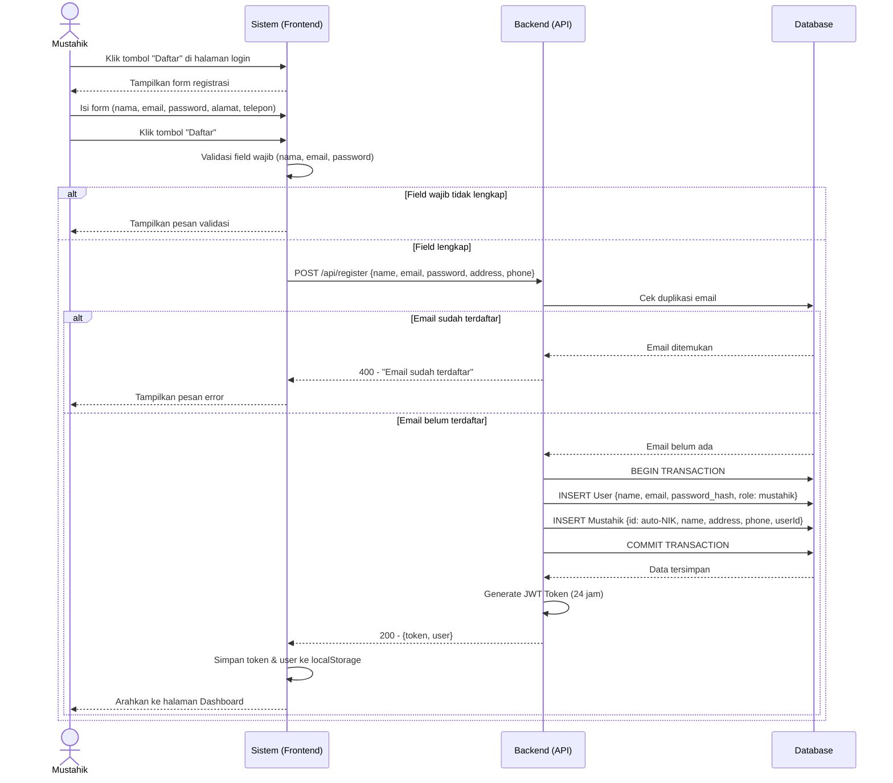
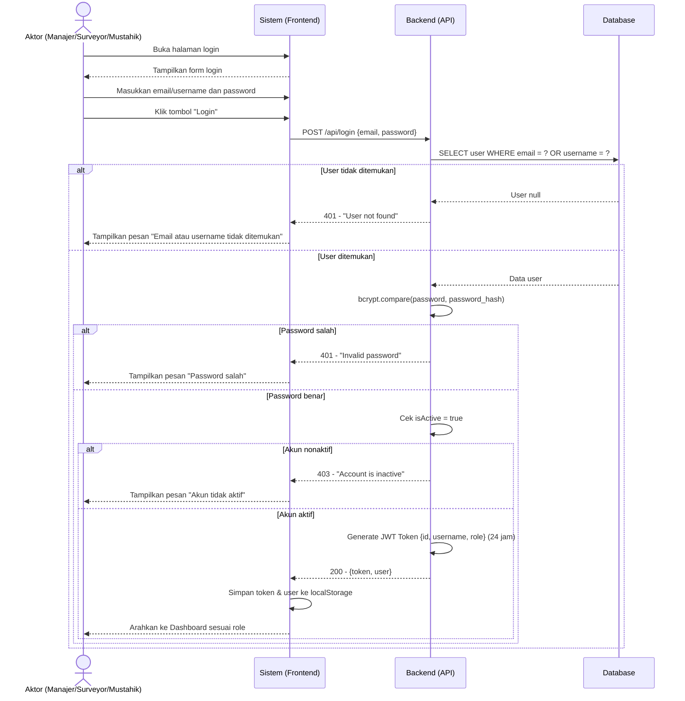
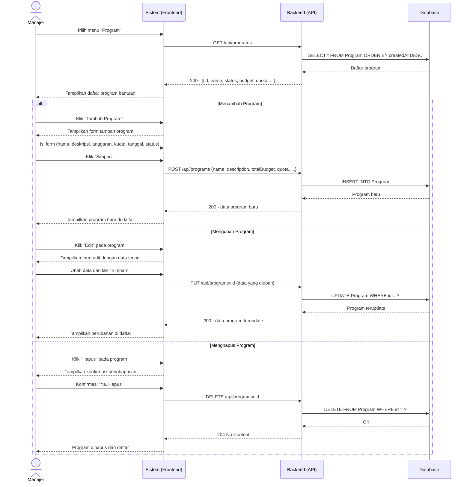
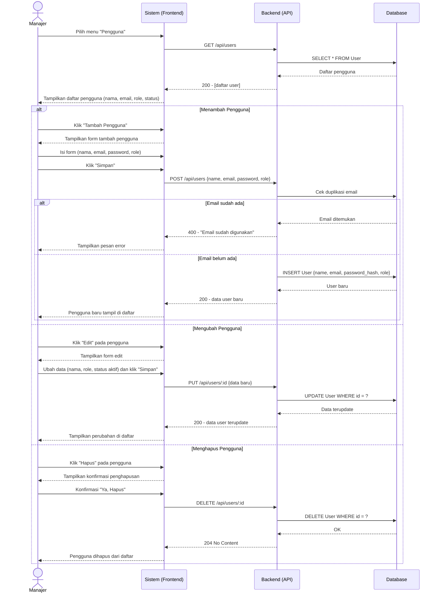
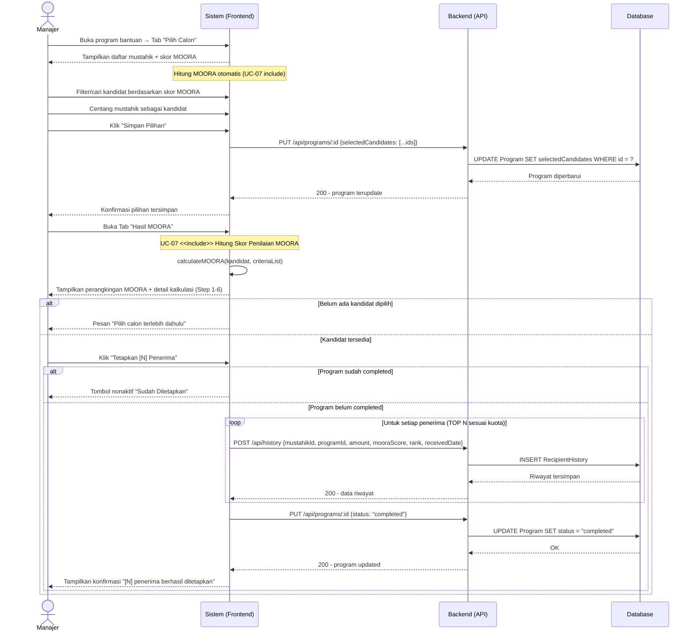
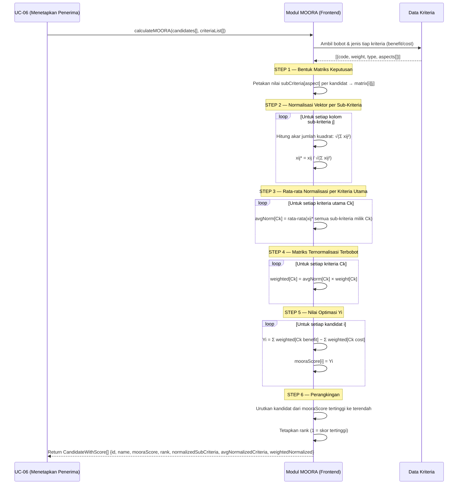
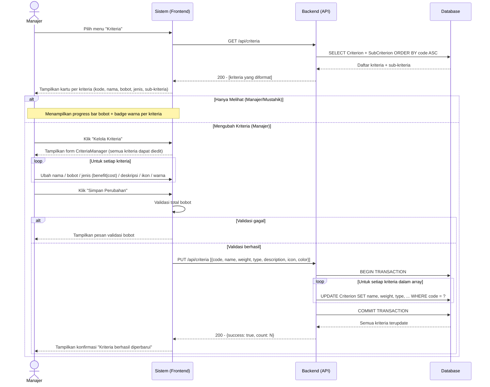
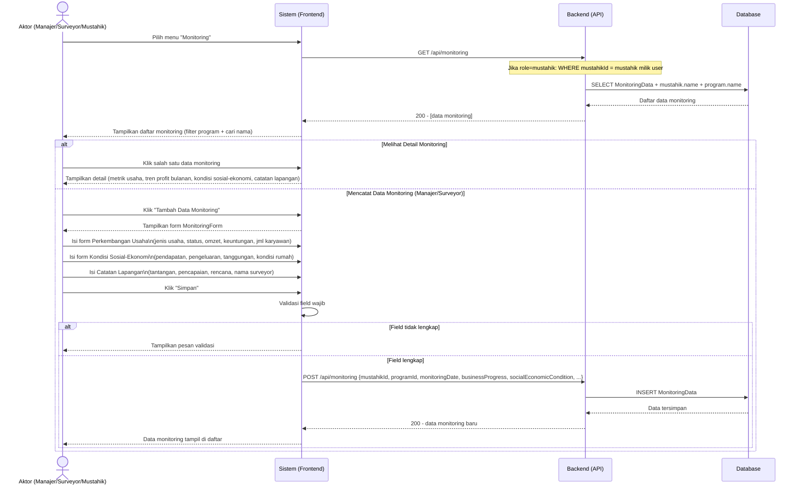
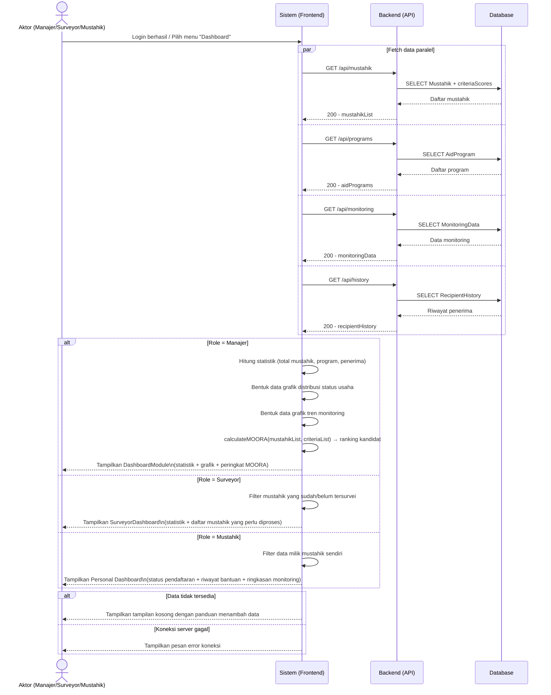
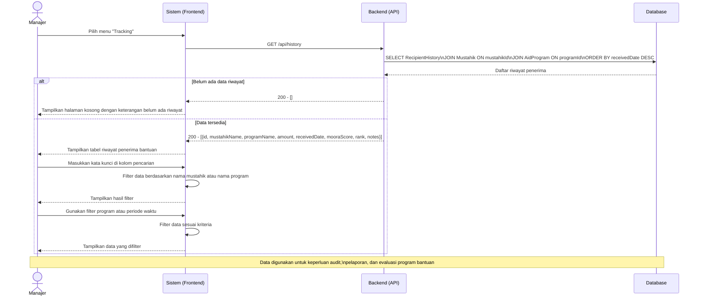

# SEQUENCE DIAGRAM
## Dashboard Monitoring Penerima Zakat Produktif Berbasis SPK MOORA

---

## UC-01: Mendaftar Akun



---

## UC-02: Login



---

## UC-03: Mengelola Program Bantuan



---

## UC-04: Mengelola Data Mustahik

>>Aktor: Tampilkan form input mustahik
        Aktor->>Sistem: Isi identitas (NIK, nama, alamat, telepon, status usaha) + skor sub-kriteria
        Aktor->>Sistem: Klik "Simpan"
        Sistem->>Backend: POST /api/mustahik {name, address, phone, subCriteria, businessStatus}
        Backend->>DB: Cari SubCriterion yang cocok per aspek
        Backend->>DB: INSERT Mustahik + MustahikScore (per sub-kriteria)
        DB-->>B```mermaid
sequenceDiagram
    actor Aktor as Aktor (Manajer/Surveyor/Mustahik)
    participant Sistem as Sistem (Frontend)
    participant Backend as Backend (API)
    participant DB as Database

    Aktor->>Sistem: Pilih menu "Mustahik"
    Sistem->>Backend: GET /api/mustahik
    Note over Backend: Jika role=mustahik: WHERE userId = req.user.id
    Backend->>DB: SELECT Mustahik + criteriaScores + subCriterion
    DB-->>Backend: Daftar mustahik beserta skor
    Backend-->>Sistem: 200 - [data mustahik + subCriteria]
    Sistem-->>Aktor: Tampilkan daftar mustahik

    alt Menambah Mustahik (Manajer/Surveyor)
        Aktor->>Sistem: Klik "Tambah Mustahik"
        Sistem--ackend: Data tersimpan
        Backend-->>Sistem: 200 - data mustahik baru + subCriteria
        Sistem-->>Aktor: Mustahik baru tampil di daftar

    else Mengubah Mustahik (Manajer/Surveyor)
        Aktor->>Sistem: Klik "Edit" pada mustahik
        Sistem-->>Aktor: Tampilkan form edit dengan data terkini
        Aktor->>Sistem: Ubah data identitas dan/atau skor sub-kriteria
        Aktor->>Sistem: Klik "Simpan"
        Sistem->>Backend: PUT /api/mustahik/:id {data baru}
        Backend->>DB: DELETE MustahikScore WHERE mustahikId = ?
        Backend->>DB: INSERT MustahikScore baru
        Backend->>DB: UPDATE Mustahik WHERE id = ?
        DB-->>Backend: Data terupdate
        Backend-->>Sistem: 200 - data mustahik terupdate
        Sistem-->>Aktor: Tampilkan perubahan

    else Menghapus Mustahik (Manajer)
        Aktor->>Sistem: Klik "Hapus" + konfirmasi
        Sistem->>Backend: DELETE /api/mustahik/:id
        Backend->>DB: DELETE MustahikScore (cascade)
        Backend->>DB: DELETE Mustahik WHERE id = ?
        DB-->>Backend: OK
        Backend-->>Sistem: 204 No Content
        Sistem-->>Aktor: Mustahik dihapus dari daftar

    else Melihat Detail Mustahik
        Aktor->>Sistem: Klik baris mustahik
        Sistem-->>Aktor: Tampilkan detail (skor kriteria + progress bar, metrik usaha, tren profit)
    end
```

---

## UC-05: Mengelola Data Pengguna



---

## UC-06: Menetapkan Penerima Bantuan



---

## UC-07: Menghitung Skor Penilaian (MOORA)



---

## UC-08: Mengelola Kriteria Penilaian



---

## UC-09: Mengelola Data Monitoring



---

## UC-10: Melihat Dashboard



---

## UC-11: Melihat Riwayat Penerima Bantuan



---

*Dokumen Sequence Diagram — Mermaid*
*Sistem: Dashboard Monitoring Penerima Zakat Produktif Berbasis SPK MOORA*
*Tanggal: Februari 2026*
