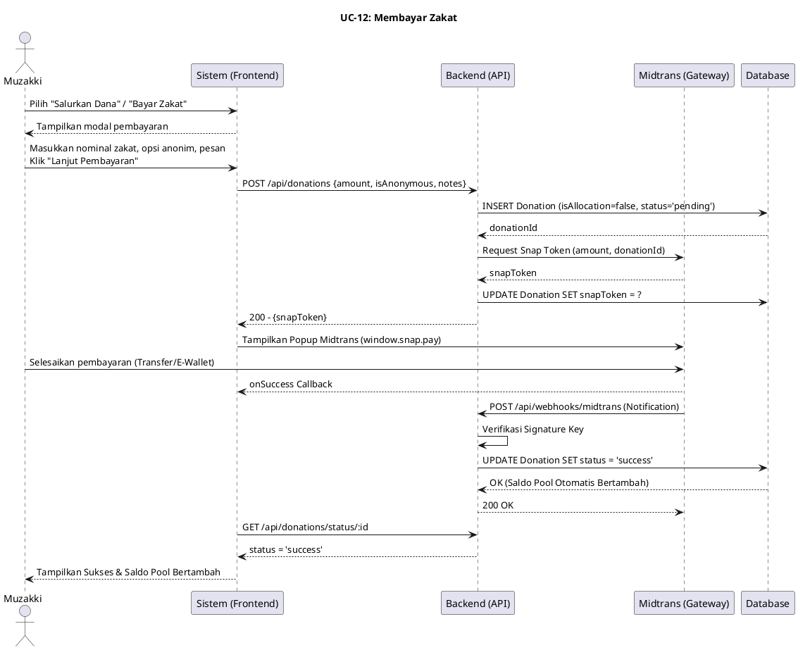
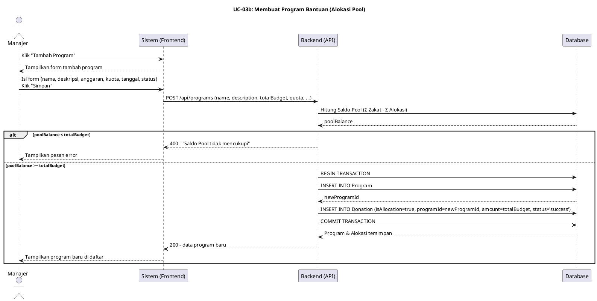

# Sequence Diagram: Mekanisme Pool Dana Zakat

Dokumen ini memuat urutan langkah (sequence) untuk dua proses utama dalam alur manajemen dana tersentralisasi (Pool) pada sistem ZakatMOORA:
1. **Membayar Zakat** oleh Muzakki, yang menambah Saldo Pool.
2. **Membuat Program Bantuan** oleh Admin/Manajer, yang mengalokasikan dan mengurangi Saldo Pool.

---

## 1. Membayar Zakat (Muzakki)

Proses ketika Muzakki menyetorkan dana zakat. Dana ini masuk ke dalam entitas `Donation` dengan penanda `isAllocation=false`. Jika sukses (via webhook Midtrans), saldo "Pool" akan bertambah secara otomatis.

---

## 2. Membuat Program Bantuan (Admin/Manajer)

Proses ketika Manajer/Admin menyiapkan suatu program bantuan baru. Sistem akan mengecek ketersediaan `poolBalance` terlebih dahulu. Jika cukup, sistem akan membuat `Program` bersamaan dengan transaksi otomatis di `Donation` bersimbol `isAllocation=true`, yang mengurangi Pool.

