# Object-Based Sequence Diagram (Visual Paradigm / PlantUML)
# Sistem Seleksi Zakat Produktif MOORA

Format: PlantUML — untuk diimpor ke Visual Paradigm

---

## UC-00: Lihat Informasi Publik (Landing Page)

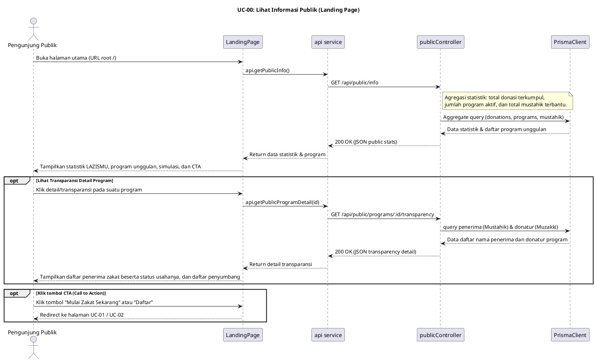
```plantuml
@startuml UC-00_Landing_Page
title UC-00: Lihat Informasi Publik (Landing Page)

actor "Pengunjung Publik" as Pengunjung
participant "LandingPage" as Landing
participant "api service" as ApiSvc
participant "publicController" as PubCtrl
participant "PrismaClient" as Prisma

Pengunjung -> Landing : Buka halaman utama (URL root /)
Landing -> ApiSvc : api.getPublicInfo()
ApiSvc -> PubCtrl : GET /api/public/info

note right of PubCtrl
  Agregasi statistik: total donasi terkumpul,
  jumlah program aktif, dan total mustahik terbantu.
end note

PubCtrl -> Prisma : Aggregate query (donations, programs, mustahik)
Prisma --> PubCtrl : Data statistik & daftar program unggulan
PubCtrl --> ApiSvc : 200 OK (JSON public stats)
ApiSvc --> Landing : Return data statistik & program
Landing --> Pengunjung : Tampilkan statistik LAZISMU, program unggulan, simulasi, dan CTA

opt Lihat Transparansi Detail Program
    Pengunjung -> Landing : Klik detail/transparansi pada suatu program
    Landing -> ApiSvc : api.getPublicProgramDetail(id)
    ApiSvc -> PubCtrl : GET /api/public/programs/:id/transparency
    PubCtrl -> Prisma : query penerima (Mustahik) & donatur (Muzakki)
    Prisma --> PubCtrl : Data daftar nama penerima dan donatur program
    PubCtrl --> ApiSvc : 200 OK (JSON transparency detail)
    ApiSvc --> Landing : Return detail transparansi
    Landing --> Pengunjung : Tampilkan daftar penerima zakat beserta status usahanya, dan daftar penyumbang
end

opt Klik tombol CTA (Call to Action)
    Pengunjung -> Landing : Klik tombol "Mulai Zakat Sekarang" atau "Daftar"
    Landing --> Pengunjung : Redirect ke halaman UC-01 / UC-02
end

@enduml
```

---

## UC-01: Login

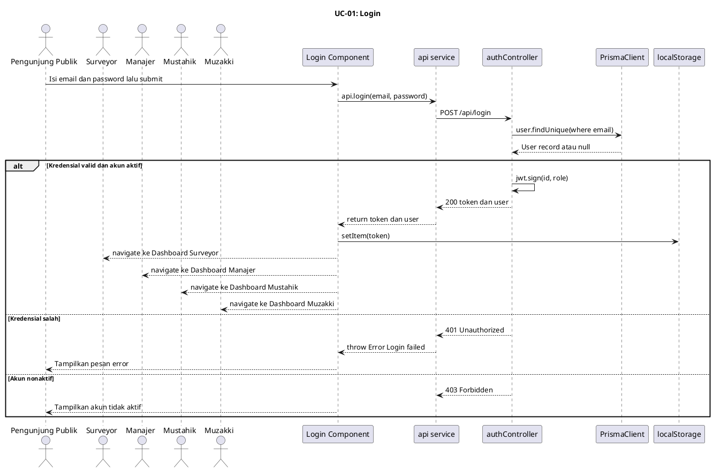
```plantuml
@startuml UC-01_Login
title UC-01: Login

actor "Pengunjung Publik" as Pengunjung
actor Surveyor
actor Manajer
actor Mustahik
actor Muzakki
participant "Login Component" as Login
participant "api service" as ApiSvc
participant "authController" as AuthCtrl
participant "PrismaClient" as Prisma
participant "localStorage" as Store

Pengunjung -> Login : Isi email dan password lalu submit
Login -> ApiSvc : api.login(email, password)
ApiSvc -> AuthCtrl : POST /api/login
AuthCtrl -> Prisma : user.findUnique(where email)
Prisma --> AuthCtrl : User record atau null

alt Kredensial valid dan akun aktif
    AuthCtrl -> AuthCtrl : jwt.sign(id, role)
    AuthCtrl --> ApiSvc : 200 token dan user
    ApiSvc --> Login : return token dan user
    Login -> Store : setItem(token)
    Login --> Surveyor : navigate ke Dashboard Surveyor
    Login --> Manajer : navigate ke Dashboard Manajer
    Login --> Mustahik : navigate ke Dashboard Mustahik
    Login --> Muzakki : navigate ke Dashboard Muzakki
else Kredensial salah
    AuthCtrl --> ApiSvc : 401 Unauthorized
    ApiSvc --> Login : throw Error Login failed
    Login --> Pengunjung : Tampilkan pesan error
else Akun nonaktif
    AuthCtrl --> ApiSvc : 403 Forbidden
    Login --> Pengunjung : Tampilkan akun tidak aktif
end
@enduml
```

---

## UC-02: Register Akun

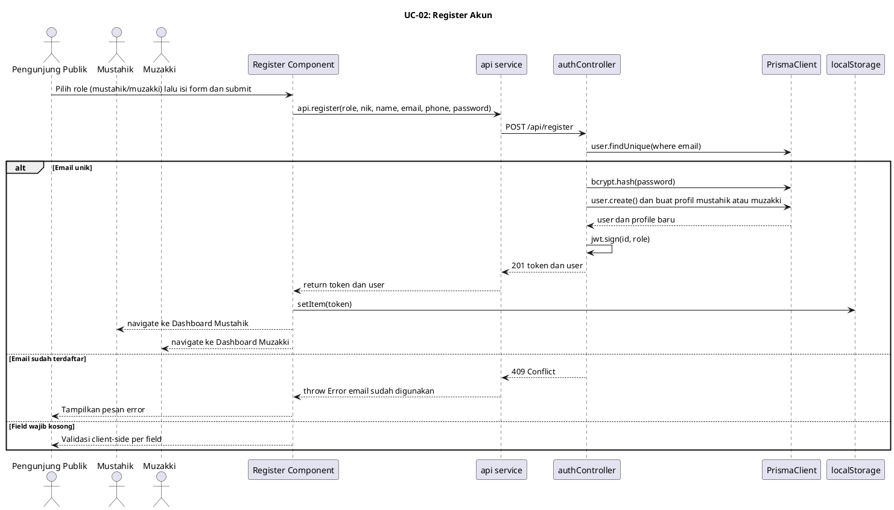
```plantuml
@startuml UC-02_Register
title UC-02: Register Akun

actor "Pengunjung Publik" as Pengunjung
actor Mustahik
actor Muzakki
participant "Register Component" as Reg
participant "api service" as ApiSvc
participant "authController" as AuthCtrl
participant "PrismaClient" as Prisma
participant "localStorage" as Store

Pengunjung -> Reg : Pilih role (mustahik/muzakki) lalu isi form dan submit
Reg -> ApiSvc : api.register(role, nik, name, email, phone, password)
ApiSvc -> AuthCtrl : POST /api/register
AuthCtrl -> Prisma : user.findUnique(where email)

alt Email unik
    AuthCtrl -> Prisma : bcrypt.hash(password)
    AuthCtrl -> Prisma : user.create() dan buat profil mustahik atau muzakki
    Prisma --> AuthCtrl : user dan profile baru
    AuthCtrl -> AuthCtrl : jwt.sign(id, role)
    AuthCtrl --> ApiSvc : 201 token dan user
    ApiSvc --> Reg : return token dan user
    Reg -> Store : setItem(token)
    Reg --> Mustahik : navigate ke Dashboard Mustahik
    Reg --> Muzakki : navigate ke Dashboard Muzakki
else Email sudah terdaftar
    AuthCtrl --> ApiSvc : 409 Conflict
    ApiSvc --> Reg : throw Error email sudah digunakan
    Reg --> Pengunjung : Tampilkan pesan error
else Field wajib kosong
    Reg --> Pengunjung : Validasi client-side per field
end
@enduml
```

---

## UC-03: Lihat Dashboard

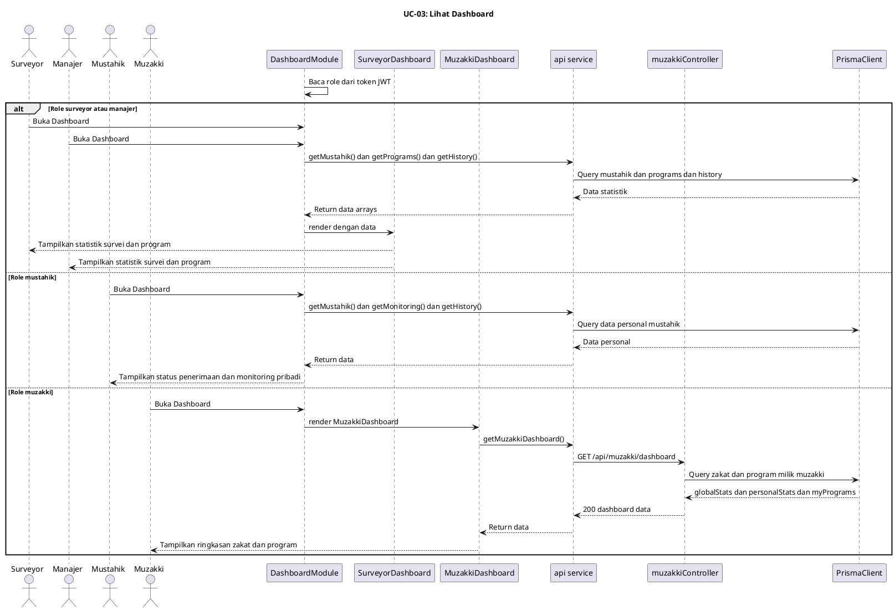
```plantuml
@startuml UC-03_Dashboard
title UC-03: Lihat Dashboard

actor Surveyor
actor Manajer
actor Mustahik
actor Muzakki
participant "DashboardModule" as DashMod
participant "SurveyorDashboard" as SurvDash
participant "MuzakkiDashboard" as MuzDash
participant "api service" as ApiSvc
participant "muzakkiController" as MuzCtrl
participant "PrismaClient" as Prisma

DashMod -> DashMod : Baca role dari token JWT

alt Role surveyor atau manajer
    Surveyor -> DashMod : Buka Dashboard
    Manajer -> DashMod : Buka Dashboard
    DashMod -> ApiSvc : getMustahik() dan getPrograms() dan getHistory()
    ApiSvc -> Prisma : Query mustahik dan programs dan history
    Prisma --> ApiSvc : Data statistik
    ApiSvc --> DashMod : Return data arrays
    DashMod -> SurvDash : render dengan data
    SurvDash --> Surveyor : Tampilkan statistik survei dan program
    SurvDash --> Manajer : Tampilkan statistik survei dan program
else Role mustahik
    Mustahik -> DashMod : Buka Dashboard
    DashMod -> ApiSvc : getMustahik() dan getMonitoring() dan getHistory()
    ApiSvc -> Prisma : Query data personal mustahik
    Prisma --> ApiSvc : Data personal
    ApiSvc --> DashMod : Return data
    DashMod --> Mustahik : Tampilkan status penerimaan dan monitoring pribadi
else Role muzakki
    Muzakki -> DashMod : Buka Dashboard
    DashMod -> MuzDash : render MuzakkiDashboard
    MuzDash -> ApiSvc : getMuzakkiDashboard()
    ApiSvc -> MuzCtrl : GET /api/muzakki/dashboard
    MuzCtrl -> Prisma : Query zakat dan program milik muzakki
    Prisma --> MuzCtrl : globalStats dan personalStats dan myPrograms
    MuzCtrl --> ApiSvc : 200 dashboard data
    ApiSvc --> MuzDash : Return data
    MuzDash --> Muzakki : Tampilkan ringkasan zakat dan program
end
@enduml
```

---

## UC-04: Kelola Data Mustahik

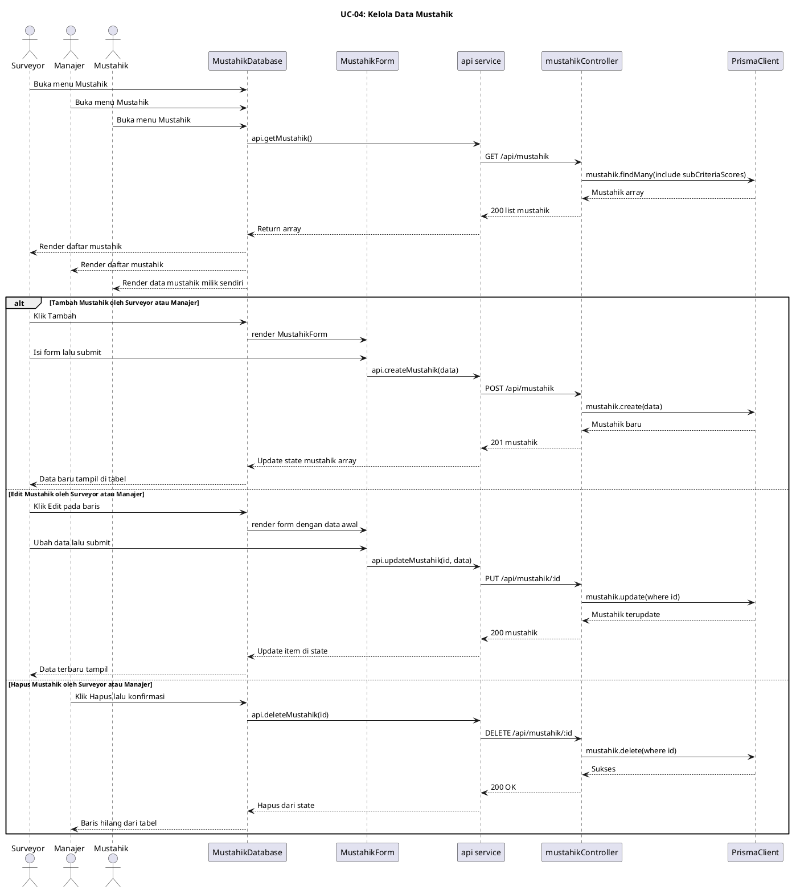
```plantuml
@startuml UC-04_Kelola_Mustahik
title UC-04: Kelola Data Mustahik

actor Surveyor
actor Manajer
actor Mustahik
participant "MustahikDatabase" as MustDB
participant "MustahikForm" as MustForm
participant "api service" as ApiSvc
participant "mustahikController" as MustCtrl
participant "PrismaClient" as Prisma

Surveyor -> MustDB : Buka menu Mustahik
Manajer -> MustDB : Buka menu Mustahik
Mustahik -> MustDB : Buka menu Mustahik
MustDB -> ApiSvc : api.getMustahik()
ApiSvc -> MustCtrl : GET /api/mustahik
MustCtrl -> Prisma : mustahik.findMany(include subCriteriaScores)
Prisma --> MustCtrl : Mustahik array
MustCtrl --> ApiSvc : 200 list mustahik
ApiSvc --> MustDB : Return array
MustDB --> Surveyor : Render daftar mustahik
MustDB --> Manajer : Render daftar mustahik
MustDB --> Mustahik : Render data mustahik milik sendiri

alt Tambah Mustahik oleh Surveyor atau Manajer
    Surveyor -> MustDB : Klik Tambah
    MustDB -> MustForm : render MustahikForm
    Surveyor -> MustForm : Isi form lalu submit
    MustForm -> ApiSvc : api.createMustahik(data)
    ApiSvc -> MustCtrl : POST /api/mustahik
    MustCtrl -> Prisma : mustahik.create(data)
    Prisma --> MustCtrl : Mustahik baru
    MustCtrl --> ApiSvc : 201 mustahik
    ApiSvc --> MustDB : Update state mustahik array
    MustDB --> Surveyor : Data baru tampil di tabel
else Edit Mustahik oleh Surveyor atau Manajer
    Surveyor -> MustDB : Klik Edit pada baris
    MustDB -> MustForm : render form dengan data awal
    Surveyor -> MustForm : Ubah data lalu submit
    MustForm -> ApiSvc : api.updateMustahik(id, data)
    ApiSvc -> MustCtrl : PUT /api/mustahik/:id
    MustCtrl -> Prisma : mustahik.update(where id)
    Prisma --> MustCtrl : Mustahik terupdate
    MustCtrl --> ApiSvc : 200 mustahik
    ApiSvc --> MustDB : Update item di state
    MustDB --> Surveyor : Data terbaru tampil
else Hapus Mustahik oleh Surveyor atau Manajer
    Manajer -> MustDB : Klik Hapus lalu konfirmasi
    MustDB -> ApiSvc : api.deleteMustahik(id)
    ApiSvc -> MustCtrl : DELETE /api/mustahik/:id
    MustCtrl -> Prisma : mustahik.delete(where id)
    Prisma --> MustCtrl : Sukses
    MustCtrl --> ApiSvc : 200 OK
    ApiSvc --> MustDB : Hapus dari state
    MustDB --> Manajer : Baris hilang dari tabel
end
@enduml
```

---

## UC-05: Input Survei dan Penilaian Kriteria

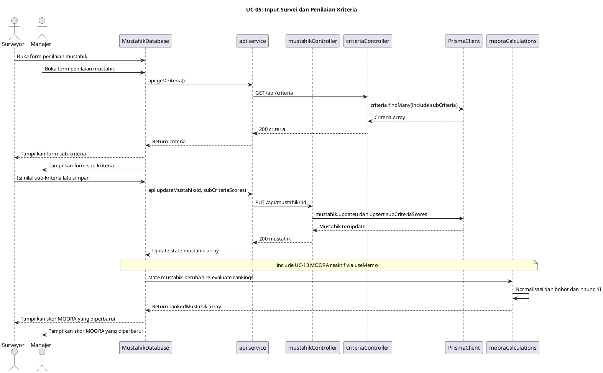
```plantuml
@startuml UC-05_Input_Survei
title UC-05: Input Survei dan Penilaian Kriteria

actor Surveyor
actor Manajer
participant "MustahikDatabase" as MustDB
participant "api service" as ApiSvc
participant "mustahikController" as MustCtrl
participant "criteriaController" as CriCtrl
participant "PrismaClient" as Prisma
participant "mooraCalculations" as MooraFn

Surveyor -> MustDB : Buka form penilaian mustahik
Manajer -> MustDB : Buka form penilaian mustahik
MustDB -> ApiSvc : api.getCriteria()
ApiSvc -> CriCtrl : GET /api/criteria
CriCtrl -> Prisma : criteria.findMany(include subCriteria)
Prisma --> CriCtrl : Criteria array
CriCtrl --> ApiSvc : 200 criteria
ApiSvc --> MustDB : Return criteria
MustDB --> Surveyor : Tampilkan form sub-kriteria
MustDB --> Manajer : Tampilkan form sub-kriteria

Surveyor -> MustDB : Isi nilai sub-kriteria lalu simpan
MustDB -> ApiSvc : api.updateMustahik(id, subCriteriaScores)
ApiSvc -> MustCtrl : PUT /api/mustahik/:id
MustCtrl -> Prisma : mustahik.update() dan upsert subCriteriaScores
Prisma --> MustCtrl : Mustahik terupdate
MustCtrl --> ApiSvc : 200 mustahik
ApiSvc --> MustDB : Update state mustahik array

note over MustDB, MooraFn : include UC-13 MOORA reaktif via useMemo
MustDB -> MooraFn : state mustahik berubah re-evaluate rankings
MooraFn -> MooraFn : Normalisasi dan bobot dan hitung Yi
MooraFn --> MustDB : Return rankedMustahik array
MustDB --> Surveyor : Tampilkan skor MOORA yang diperbarui
MustDB --> Manajer : Tampilkan skor MOORA yang diperbarui
@enduml
```

---

## UC-06: Lihat Detail Mustahik

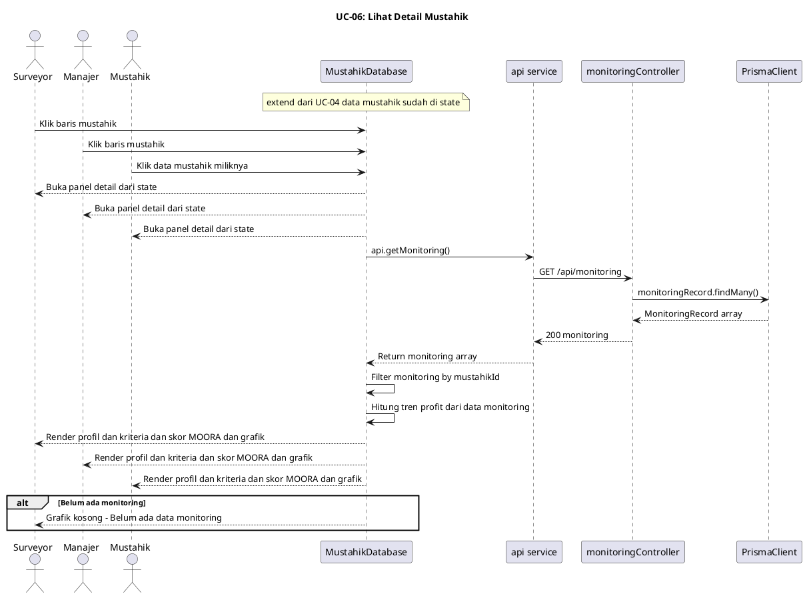
```plantuml
@startuml UC-06_Detail_Mustahik
title UC-06: Lihat Detail Mustahik

actor Surveyor
actor Manajer
actor Mustahik
participant "MustahikDatabase" as MustDB
participant "api service" as ApiSvc
participant "monitoringController" as MonCtrl
participant "PrismaClient" as Prisma

note over MustDB : extend dari UC-04 data mustahik sudah di state

Surveyor -> MustDB : Klik baris mustahik
Manajer -> MustDB : Klik baris mustahik
Mustahik -> MustDB : Klik data mustahik miliknya
MustDB --> Surveyor : Buka panel detail dari state
MustDB --> Manajer : Buka panel detail dari state
MustDB --> Mustahik : Buka panel detail dari state

MustDB -> ApiSvc : api.getMonitoring()
ApiSvc -> MonCtrl : GET /api/monitoring
MonCtrl -> Prisma : monitoringRecord.findMany()
Prisma --> MonCtrl : MonitoringRecord array
MonCtrl --> ApiSvc : 200 monitoring
ApiSvc --> MustDB : Return monitoring array
MustDB -> MustDB : Filter monitoring by mustahikId
MustDB -> MustDB : Hitung tren profit dari data monitoring
MustDB --> Surveyor : Render profil dan kriteria dan skor MOORA dan grafik
MustDB --> Manajer : Render profil dan kriteria dan skor MOORA dan grafik
MustDB --> Mustahik : Render profil dan kriteria dan skor MOORA dan grafik

alt Belum ada monitoring
    MustDB --> Surveyor : Grafik kosong - Belum ada data monitoring
end
@enduml
```

---

## UC-07: Filter dan Cari Mustahik

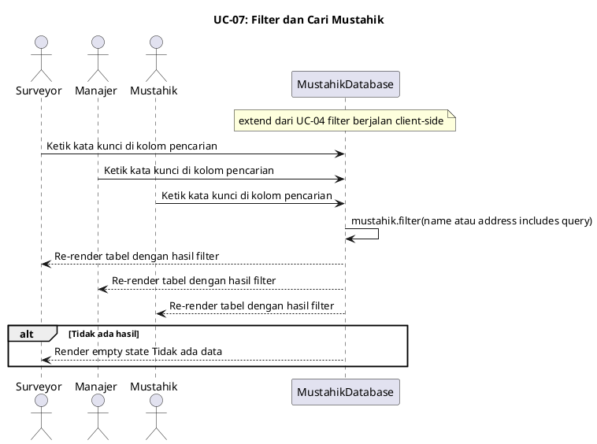
```plantuml
@startuml UC-07_Filter_Mustahik
title UC-07: Filter dan Cari Mustahik

actor Surveyor
actor Manajer
actor Mustahik
participant "MustahikDatabase" as MustDB

note over MustDB : extend dari UC-04 filter berjalan client-side

Surveyor -> MustDB : Ketik kata kunci di kolom pencarian
Manajer -> MustDB : Ketik kata kunci di kolom pencarian
Mustahik -> MustDB : Ketik kata kunci di kolom pencarian
MustDB -> MustDB : mustahik.filter(name atau address includes query)
MustDB --> Surveyor : Re-render tabel dengan hasil filter
MustDB --> Manajer : Re-render tabel dengan hasil filter
MustDB --> Mustahik : Re-render tabel dengan hasil filter

alt Tidak ada hasil
    MustDB --> Surveyor : Render empty state Tidak ada data
end
@enduml
```

---

## UC-08: Kelola Data Muzakki

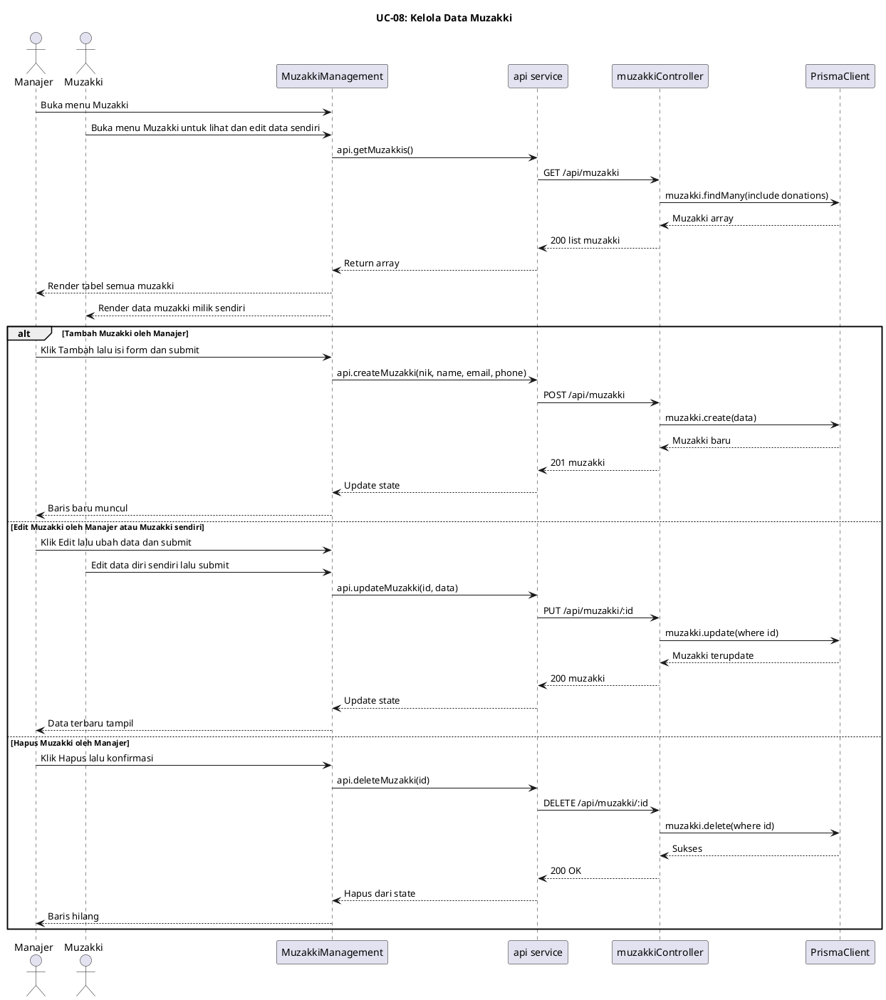
```plantuml
@startuml UC-08_Kelola_Muzakki
title UC-08: Kelola Data Muzakki

actor Manajer
actor Muzakki
participant "MuzakkiManagement" as MuzMgmt
participant "api service" as ApiSvc
participant "muzakkiController" as MuzCtrl
participant "PrismaClient" as Prisma

Manajer -> MuzMgmt : Buka menu Muzakki
Muzakki -> MuzMgmt : Buka menu Muzakki untuk lihat dan edit data sendiri
MuzMgmt -> ApiSvc : api.getMuzakkis()
ApiSvc -> MuzCtrl : GET /api/muzakki
MuzCtrl -> Prisma : muzakki.findMany(include donations)
Prisma --> MuzCtrl : Muzakki array
MuzCtrl --> ApiSvc : 200 list muzakki
ApiSvc --> MuzMgmt : Return array
MuzMgmt --> Manajer : Render tabel semua muzakki
MuzMgmt --> Muzakki : Render data muzakki milik sendiri

alt Tambah Muzakki oleh Manajer
    Manajer -> MuzMgmt : Klik Tambah lalu isi form dan submit
    MuzMgmt -> ApiSvc : api.createMuzakki(nik, name, email, phone)
    ApiSvc -> MuzCtrl : POST /api/muzakki
    MuzCtrl -> Prisma : muzakki.create(data)
    Prisma --> MuzCtrl : Muzakki baru
    MuzCtrl --> ApiSvc : 201 muzakki
    ApiSvc --> MuzMgmt : Update state
    MuzMgmt --> Manajer : Baris baru muncul
else Edit Muzakki oleh Manajer atau Muzakki sendiri
    Manajer -> MuzMgmt : Klik Edit lalu ubah data dan submit
    Muzakki -> MuzMgmt : Edit data diri sendiri lalu submit
    MuzMgmt -> ApiSvc : api.updateMuzakki(id, data)
    ApiSvc -> MuzCtrl : PUT /api/muzakki/:id
    MuzCtrl -> Prisma : muzakki.update(where id)
    Prisma --> MuzCtrl : Muzakki terupdate
    MuzCtrl --> ApiSvc : 200 muzakki
    ApiSvc --> MuzMgmt : Update state
    MuzMgmt --> Manajer : Data terbaru tampil
else Hapus Muzakki oleh Manajer
    Manajer -> MuzMgmt : Klik Hapus lalu konfirmasi
    MuzMgmt -> ApiSvc : api.deleteMuzakki(id)
    ApiSvc -> MuzCtrl : DELETE /api/muzakki/:id
    MuzCtrl -> Prisma : muzakki.delete(where id)
    Prisma --> MuzCtrl : Sukses
    MuzCtrl --> ApiSvc : 200 OK
    ApiSvc --> MuzMgmt : Hapus dari state
    MuzMgmt --> Manajer : Baris hilang
end
@enduml
```

---

## UC-09: Catat zakat oleh Muzakki via Midtrans Snap

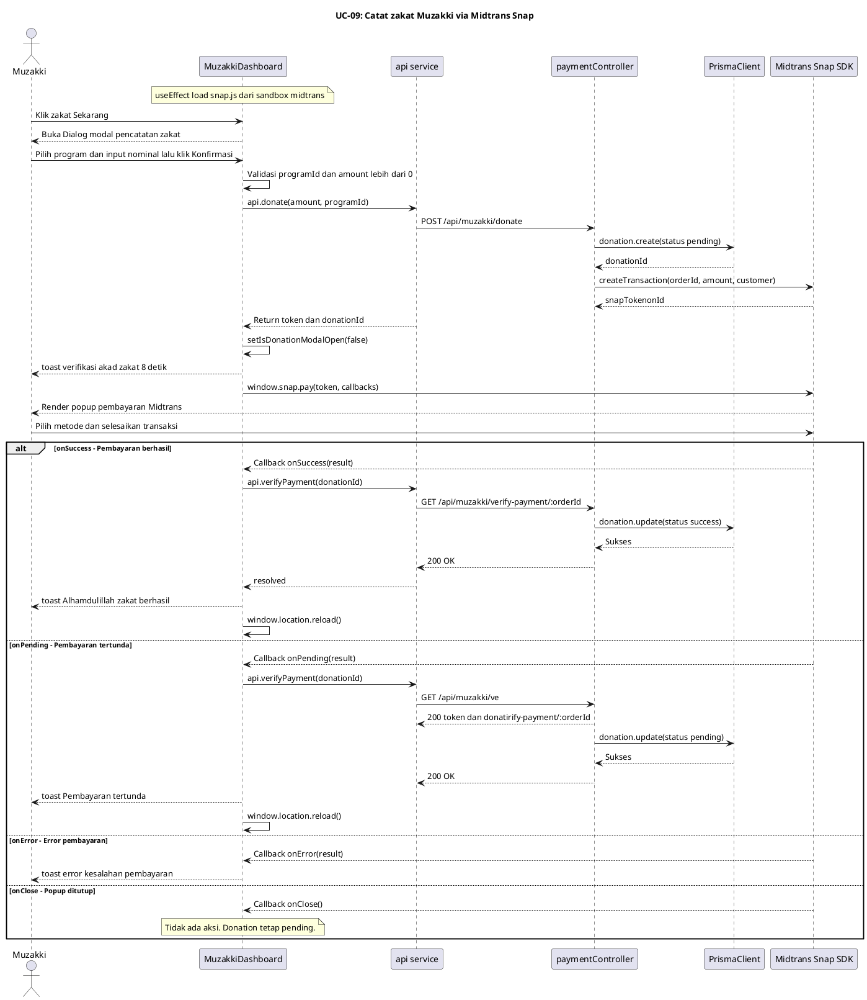
```plantuml
@startuml UC-09_Donasi_Muzakki
title UC-09: Catat zakat Muzakki via Midtrans Snap

actor Muzakki
participant "MuzakkiDashboard" as MuzDash
participant "api service" as ApiSvc
participant "paymentController" as PayCtrl
participant "PrismaClient" as Prisma
participant "Midtrans Snap SDK" as Snap

note over MuzDash : useEffect load snap.js dari sandbox midtrans

Muzakki -> MuzDash : Klik zakat Sekarang
MuzDash --> Muzakki : Buka Dialog modal pencatatan zakat

Muzakki -> MuzDash : Pilih program dan input nominal lalu klik Konfirmasi
MuzDash -> MuzDash : Validasi programId dan amount lebih dari 0

MuzDash -> ApiSvc : api.donate(amount, programId)
ApiSvc -> PayCtrl : POST /api/muzakki/donate
PayCtrl -> Prisma : donation.create(status pending)
Prisma --> PayCtrl : donationId
PayCtrl -> Snap : createTransaction(orderId, amount, customer)
Snap --> PayCtrl : snapTokenonId
ApiSvc --> MuzDash : Return token dan donationId

MuzDash -> MuzDash : setIsDonationModalOpen(false)
MuzDash --> Muzakki : toast verifikasi akad zakat 8 detik
MuzDash -> Snap : window.snap.pay(token, callbacks)
Snap --> Muzakki : Render popup pembayaran Midtrans

Muzakki -> Snap : Pilih metode dan selesaikan transaksi

alt onSuccess - Pembayaran berhasil
    Snap --> MuzDash : Callback onSuccess(result)
    MuzDash -> ApiSvc : api.verifyPayment(donationId)
    ApiSvc -> PayCtrl : GET /api/muzakki/verify-payment/:orderId
    PayCtrl -> Prisma : donation.update(status success)
    Prisma --> PayCtrl : Sukses
    PayCtrl --> ApiSvc : 200 OK
    ApiSvc --> MuzDash : resolved
    MuzDash --> Muzakki : toast Alhamdulillah zakat berhasil
    MuzDash -> MuzDash : window.location.reload()
else onPending - Pembayaran tertunda
    Snap --> MuzDash : Callback onPending(result)
    MuzDash -> ApiSvc : api.verifyPayment(donationId)
    ApiSvc -> PayCtrl : GET /api/muzakki/ve
PayCtrl --> ApiSvc : 200 token dan donatirify-payment/:orderId
    PayCtrl -> Prisma : donation.update(status pending)
    Prisma --> PayCtrl : Sukses
    PayCtrl --> ApiSvc : 200 OK
    MuzDash --> Muzakki : toast Pembayaran tertunda
    MuzDash -> MuzDash : window.location.reload()
else onError - Error pembayaran
    Snap --> MuzDash : Callback onError(result)
    MuzDash --> Muzakki : toast error kesalahan pembayaran
else onClose - Popup ditutup
    Snap --> MuzDash : Callback onClose()
    note over MuzDash : Tidak ada aksi. Donation tetap pending.
end
@enduml
```

---

## UC-09b: Catat zakat oleh Manajer

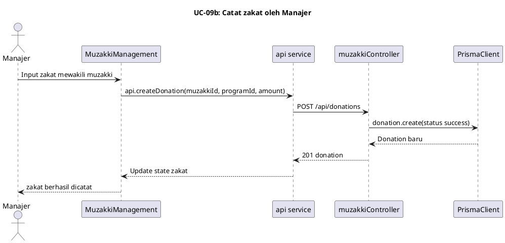
```plantuml
@startuml UC-09b_Donasi_Manajer
title UC-09b: Catat zakat oleh Manajer

actor Manajer
participant "MuzakkiManagement" as MuzMgmt
participant "api service" as ApiSvc
participant "muzakkiController" as MuzCtrl
participant "PrismaClient" as Prisma

Manajer -> MuzMgmt : Input zakat mewakili muzakki
MuzMgmt -> ApiSvc : api.createDonation(muzakkiId, programId, amount)
ApiSvc -> MuzCtrl : POST /api/donations
MuzCtrl -> Prisma : donation.create(status success)
Prisma --> MuzCtrl : Donation baru
MuzCtrl --> ApiSvc : 201 donation
ApiSvc --> MuzMgmt : Update state zakat
MuzMgmt --> Manajer : zakat berhasil dicatat
@enduml
```

---

## UC-10: Lihat Riwayat zakat

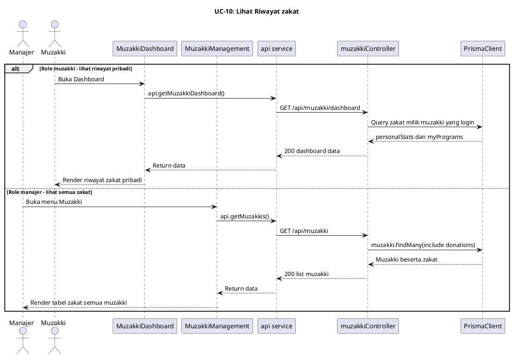
```plantuml
@startuml UC-10_Riwayat_Donasi
title UC-10: Lihat Riwayat zakat

actor Manajer
actor Muzakki
participant "MuzakkiDashboard" as MuzDash
participant "MuzakkiManagement" as MuzMgmt
participant "api service" as ApiSvc
participant "muzakkiController" as MuzCtrl
participant "PrismaClient" as Prisma

alt Role muzakki - lihat riwayat pribadi
    Muzakki -> MuzDash : Buka Dashboard
    MuzDash -> ApiSvc : api.getMuzakkiDashboard()
    ApiSvc -> MuzCtrl : GET /api/muzakki/dashboard
    MuzCtrl -> Prisma : Query zakat milik muzakki yang login
    Prisma --> MuzCtrl : personalStats dan myPrograms
    MuzCtrl --> ApiSvc : 200 dashboard data
    ApiSvc --> MuzDash : Return data
    MuzDash --> Muzakki : Render riwayat zakat pribadi
else Role manajer - lihat semua zakat
    Manajer -> MuzMgmt : Buka menu Muzakki
    MuzMgmt -> ApiSvc : api.getMuzakkis()
    ApiSvc -> MuzCtrl : GET /api/muzakki
    MuzCtrl -> Prisma : muzakki.findMany(include donations)
    Prisma --> MuzCtrl : Muzakki beserta zakat
    MuzCtrl --> ApiSvc : 200 list muzakki
    ApiSvc --> MuzMgmt : Return data
    MuzMgmt --> Manajer : Render tabel zakat semua muzakki
end
@enduml
```

---

## UC-11: Kelola Program Bantuan

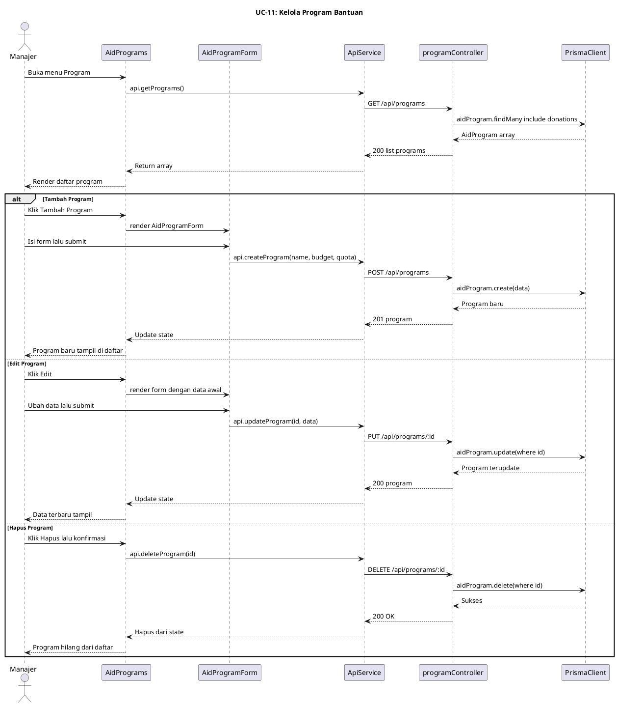
```plantuml
@startuml UC-11_Kelola_Program
title UC-11: Kelola Program Bantuan

actor Manajer
participant AidPrograms as AidProg
participant AidProgramForm as AidForm
participant ApiService as ApiSvc
participant programController as ProgCtrl
participant PrismaClient as Prisma

Manajer -> AidProg : Buka menu Program
AidProg -> ApiSvc : api.getPrograms()
ApiSvc -> ProgCtrl : GET /api/programs
ProgCtrl -> Prisma : aidProgram.findMany include donations
Prisma --> ProgCtrl : AidProgram array
ProgCtrl --> ApiSvc : 200 list programs
ApiSvc --> AidProg : Return array
AidProg --> Manajer : Render daftar program

alt Tambah Program
    Manajer -> AidProg : Klik Tambah Program
    AidProg -> AidForm : render AidProgramForm
    Manajer -> AidForm : Isi form lalu submit
    AidForm -> ApiSvc : api.createProgram(name, budget, quota)
    ApiSvc -> ProgCtrl : POST /api/programs
    ProgCtrl -> Prisma : aidProgram.create(data)
    Prisma --> ProgCtrl : Program baru
    ProgCtrl --> ApiSvc : 201 program
    ApiSvc --> AidProg : Update state
    AidProg --> Manajer : Program baru tampil di daftar
else Edit Program
    Manajer -> AidProg : Klik Edit
    AidProg -> AidForm : render form dengan data awal
    Manajer -> AidForm : Ubah data lalu submit
    AidForm -> ApiSvc : api.updateProgram(id, data)
    ApiSvc -> ProgCtrl : PUT /api/programs/:id
    ProgCtrl -> Prisma : aidProgram.update(where id)
    Prisma --> ProgCtrl : Program terupdate
    ProgCtrl --> ApiSvc : 200 program
    ApiSvc --> AidProg : Update state
    AidProg --> Manajer : Data terbaru tampil
else Hapus Program
    Manajer -> AidProg : Klik Hapus lalu konfirmasi
    AidProg -> ApiSvc : api.deleteProgram(id)
    ApiSvc -> ProgCtrl : DELETE /api/programs/:id
    ProgCtrl -> Prisma : aidProgram.delete(where id)
    Prisma --> ProgCtrl : Sukses
    ProgCtrl --> ApiSvc : 200 OK
    ApiSvc --> AidProg : Hapus dari state
    AidProg --> Manajer : Program hilang dari daftar
end
@enduml
```

---

## UC-12: Kelola Calon dan Penerima Program

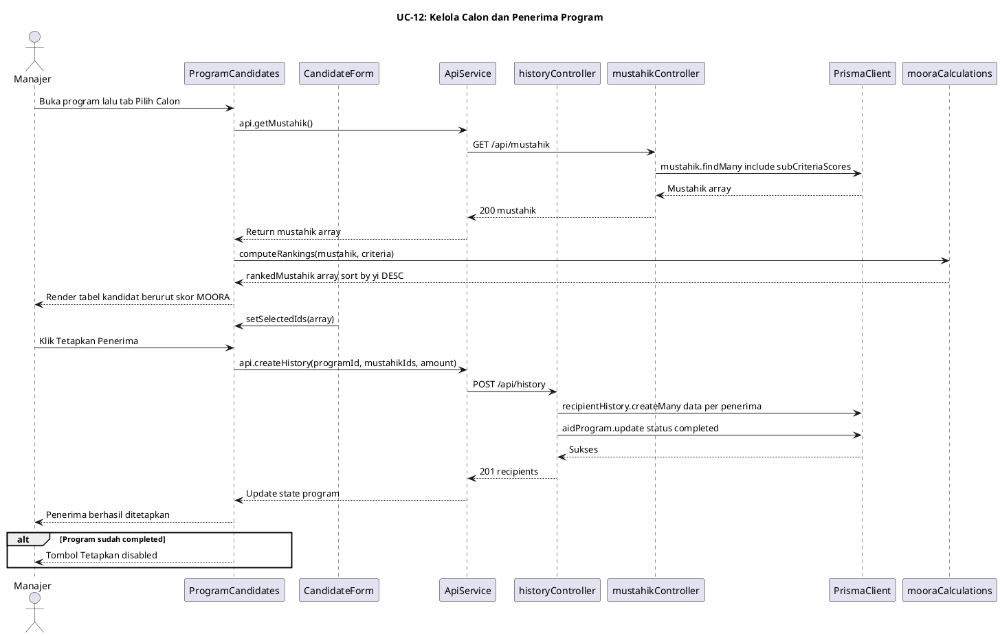
```plantuml
@startuml UC-12_Kelola_Calon
title UC-12: Kelola Calon dan Penerima Program

actor Manajer
participant ProgramCandidates as ProgCand
participant CandidateForm as CandForm
participant ApiService as ApiSvc
participant historyController as HistCtrl
participant mustahikController as MustCtrl
participant PrismaClient as Prisma
participant mooraCalculations as MooraFn

Manajer -> ProgCand : Buka program lalu tab Pilih Calon
ProgCand -> ApiSvc : api.getMustahik()
ApiSvc -> MustCtrl : GET /api/mustahik
MustCtrl -> Prisma : mustahik.findMany include subCriteriaScores
Prisma --> MustCtrl : Mustahik array
MustCtrl --> ApiSvc : 200 mustahik
ApiSvc --> ProgCand : Return mustahik array

ProgCand -> MooraFn : computeRankings(mustahik, criteria)
MooraFn --> ProgCand : rankedMustahik array sort by yi DESC
ProgCand --> Manajer : Render tabel kandidat berurut skor MOORA

CandForm -> ProgCand : setSelectedIds(array)

Manajer -> ProgCand : Klik Tetapkan Penerima
ProgCand -> ApiSvc : api.createHistory(programId, mustahikIds, amount)
ApiSvc -> HistCtrl : POST /api/history
HistCtrl -> Prisma : recipientHistory.createMany data per penerima
HistCtrl -> Prisma : aidProgram.update status completed
Prisma --> HistCtrl : Sukses
HistCtrl --> ApiSvc : 201 recipients
ApiSvc --> ProgCand : Update state program
ProgCand --> Manajer : Penerima berhasil ditetapkan

alt Program sudah completed
    ProgCand --> Manajer : Tombol Tetapkan disabled
end
@enduml
```

---

## UC-13: Hitung Perangkingan MOORA

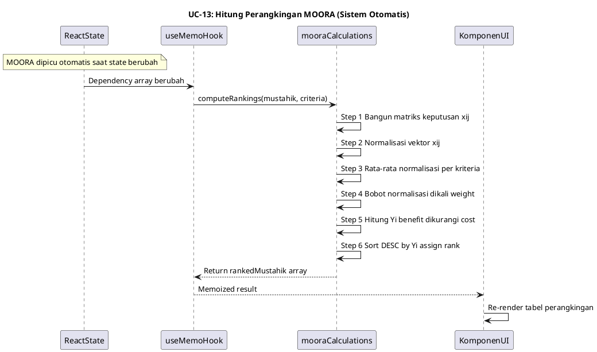
```plantuml
@startuml UC-13_MOORA
title UC-13: Hitung Perangkingan MOORA (Sistem Otomatis)

participant ReactState as StateChg
participant useMemoHook as UseMemo
participant mooraCalculations as MooraFn
participant KomponenUI as UI

note over StateChg : MOORA dipicu otomatis saat state berubah

StateChg -> UseMemo : Dependency array berubah
UseMemo -> MooraFn : computeRankings(mustahik, criteria)

MooraFn -> MooraFn : Step 1 Bangun matriks keputusan xij
MooraFn -> MooraFn : Step 2 Normalisasi vektor xij
MooraFn -> MooraFn : Step 3 Rata-rata normalisasi per kriteria
MooraFn -> MooraFn : Step 4 Bobot normalisasi dikali weight
MooraFn -> MooraFn : Step 5 Hitung Yi benefit dikurangi cost
MooraFn -> MooraFn : Step 6 Sort DESC by Yi assign rank

MooraFn --> UseMemo : Return rankedMustahik array
UseMemo --> UI : Memoized result
UI -> UI : Re-render tabel perangkingan
@enduml
```

---

## UC-14: Lihat Hasil Perangkingan

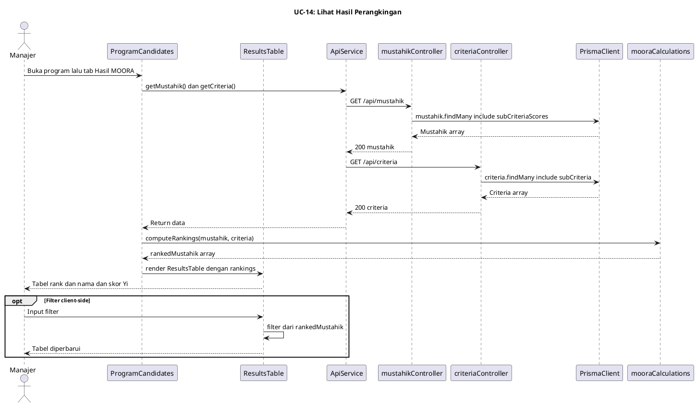
```plantuml
@startuml UC-14_Hasil_MOORA
title UC-14: Lihat Hasil Perangkingan

actor Manajer
participant ProgramCandidates as ProgCand
participant ResultsTable as ResTbl
participant ApiService as ApiSvc
participant mustahikController as MustCtrl
participant criteriaController as CriCtrl
participant PrismaClient as Prisma
participant mooraCalculations as MooraFn

Manajer -> ProgCand : Buka program lalu tab Hasil MOORA
ProgCand -> ApiSvc : getMustahik() dan getCriteria()
ApiSvc -> MustCtrl : GET /api/mustahik
MustCtrl -> Prisma : mustahik.findMany include subCriteriaScores
Prisma --> MustCtrl : Mustahik array
MustCtrl --> ApiSvc : 200 mustahik
ApiSvc -> CriCtrl : GET /api/criteria
CriCtrl -> Prisma : criteria.findMany include subCriteria
Prisma --> CriCtrl : Criteria array
CriCtrl --> ApiSvc : 200 criteria
ApiSvc --> ProgCand : Return data

ProgCand -> MooraFn : computeRankings(mustahik, criteria)
MooraFn --> ProgCand : rankedMustahik array

ProgCand -> ResTbl : render ResultsTable dengan rankings
ResTbl --> Manajer : Tabel rank dan nama dan skor Yi

opt Filter client-side
    Manajer -> ResTbl : Input filter
    ResTbl -> ResTbl : filter dari rankedMustahik
    ResTbl --> Manajer : Tabel diperbarui
end
@enduml
```

---

## UC-15: Lihat Detail Perhitungan

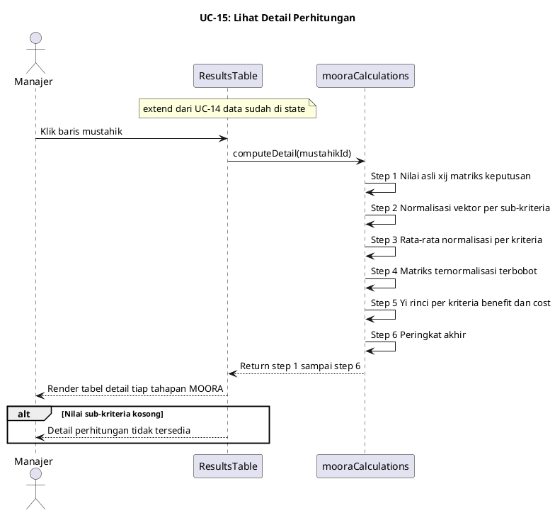
```plantuml
@startuml UC-15_Detail_Perhitungan
title UC-15: Lihat Detail Perhitungan

actor Manajer
participant ResultsTable as ResTbl
participant mooraCalculations as MooraFn

note over ResTbl : extend dari UC-14 data sudah di state

Manajer -> ResTbl : Klik baris mustahik
ResTbl -> MooraFn : computeDetail(mustahikId)
MooraFn -> MooraFn : Step 1 Nilai asli xij matriks keputusan
MooraFn -> MooraFn : Step 2 Normalisasi vektor per sub-kriteria
MooraFn -> MooraFn : Step 3 Rata-rata normalisasi per kriteria
MooraFn -> MooraFn : Step 4 Matriks ternormalisasi terbobot
MooraFn -> MooraFn : Step 5 Yi rinci per kriteria benefit dan cost
MooraFn -> MooraFn : Step 6 Peringkat akhir
MooraFn --> ResTbl : Return step 1 sampai step 6

ResTbl --> Manajer : Render tabel detail tiap tahapan MOORA

alt Nilai sub-kriteria kosong
    ResTbl --> Manajer : Detail perhitungan tidak tersedia
end
@enduml
```

---

## UC-16: Kelola Kriteria dan Bobot

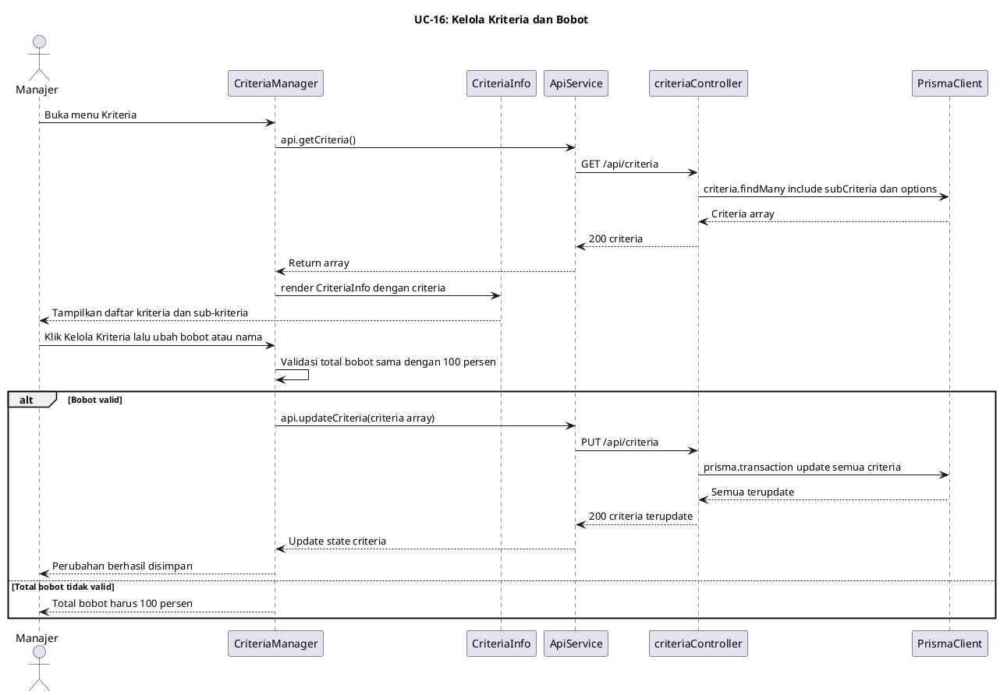
```plantuml
@startuml UC-16_Kelola_Kriteria
title UC-16: Kelola Kriteria dan Bobot

actor Manajer
participant CriteriaManager as CritMgr
participant CriteriaInfo as CritInfo
participant ApiService as ApiSvc
participant criteriaController as CriCtrl
participant PrismaClient as Prisma

Manajer -> CritMgr : Buka menu Kriteria
CritMgr -> ApiSvc : api.getCriteria()
ApiSvc -> CriCtrl : GET /api/criteria
CriCtrl -> Prisma : criteria.findMany include subCriteria dan options
Prisma --> CriCtrl : Criteria array
CriCtrl --> ApiSvc : 200 criteria
ApiSvc --> CritMgr : Return array
CritMgr -> CritInfo : render CriteriaInfo dengan criteria
CritInfo --> Manajer : Tampilkan daftar kriteria dan sub-kriteria

Manajer -> CritMgr : Klik Kelola Kriteria lalu ubah bobot atau nama
CritMgr -> CritMgr : Validasi total bobot sama dengan 100 persen

alt Bobot valid
    CritMgr -> ApiSvc : api.updateCriteria(criteria array)
    ApiSvc -> CriCtrl : PUT /api/criteria
    CriCtrl -> Prisma : prisma.transaction update semua criteria
    Prisma --> CriCtrl : Semua terupdate
    CriCtrl --> ApiSvc : 200 criteria terupdate
    ApiSvc --> CritMgr : Update state criteria
    CritMgr --> Manajer : Perubahan berhasil disimpan
else Total bobot tidak valid
    CritMgr --> Manajer : Total bobot harus 100 persen
end
@enduml
```

---

## UC-17: Input Data Monitoring

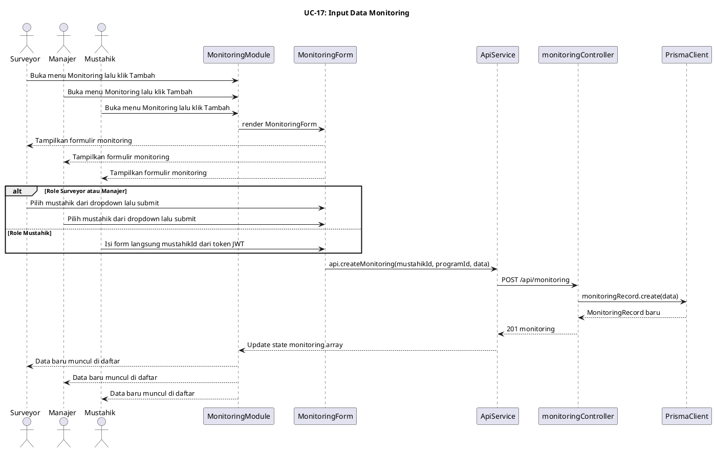
```plantuml
@startuml UC-17_Input_Monitoring
title UC-17: Input Data Monitoring

actor Surveyor
actor Manajer
actor Mustahik
participant MonitoringModule as MonMod
participant MonitoringForm as MonForm
participant ApiService as ApiSvc
participant monitoringController as MonCtrl
participant PrismaClient as Prisma

Surveyor -> MonMod : Buka menu Monitoring lalu klik Tambah
Manajer -> MonMod : Buka menu Monitoring lalu klik Tambah
Mustahik -> MonMod : Buka menu Monitoring lalu klik Tambah
MonMod -> MonForm : render MonitoringForm
MonForm --> Surveyor : Tampilkan formulir monitoring
MonForm --> Manajer : Tampilkan formulir monitoring
MonForm --> Mustahik : Tampilkan formulir monitoring

alt Role Surveyor atau Manajer
    Surveyor -> MonForm : Pilih mustahik dari dropdown lalu submit
    Manajer -> MonForm : Pilih mustahik dari dropdown lalu submit
else Role Mustahik
    Mustahik -> MonForm : Isi form langsung mustahikId dari token JWT
end

MonForm -> ApiSvc : api.createMonitoring(mustahikId, programId, data)
ApiSvc -> MonCtrl : POST /api/monitoring
MonCtrl -> Prisma : monitoringRecord.create(data)
Prisma --> MonCtrl : MonitoringRecord baru
MonCtrl --> ApiSvc : 201 monitoring
ApiSvc --> MonMod : Update state monitoring array
MonMod --> Surveyor : Data baru muncul di daftar
MonMod --> Manajer : Data baru muncul di daftar
MonMod --> Mustahik : Data baru muncul di daftar
@enduml
```

---

## UC-18: Lihat Riwayat Monitoring

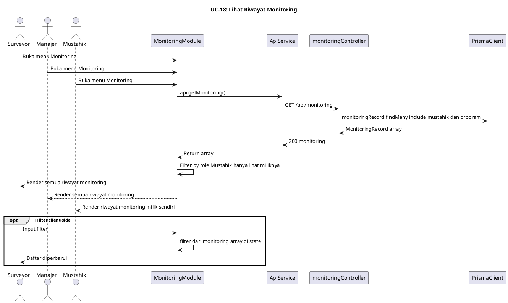
```plantuml
@startuml UC-18_Riwayat_Monitoring
title UC-18: Lihat Riwayat Monitoring

actor Surveyor
actor Manajer
actor Mustahik
participant MonitoringModule as MonMod
participant ApiService as ApiSvc
participant monitoringController as MonCtrl
participant PrismaClient as Prisma

Surveyor -> MonMod : Buka menu Monitoring
Manajer -> MonMod : Buka menu Monitoring
Mustahik -> MonMod : Buka menu Monitoring
MonMod -> ApiSvc : api.getMonitoring()
ApiSvc -> MonCtrl : GET /api/monitoring
MonCtrl -> Prisma : monitoringRecord.findMany include mustahik dan program
Prisma --> MonCtrl : MonitoringRecord array
MonCtrl --> ApiSvc : 200 monitoring
ApiSvc --> MonMod : Return array

MonMod -> MonMod : Filter by role Mustahik hanya lihat miliknya
MonMod --> Surveyor : Render semua riwayat monitoring
MonMod --> Manajer : Render semua riwayat monitoring
MonMod --> Mustahik : Render riwayat monitoring milik sendiri

opt Filter client-side
    Surveyor -> MonMod : Input filter
    MonMod -> MonMod : filter dari monitoring array di state
    MonMod --> Surveyor : Daftar diperbarui
end
@enduml
```

---

## UC-19: Lihat Detail Monitoring

```plantuml
@startuml UC-19_Detail_Monitoring
title UC-19: Lihat Detail Monitoring

actor Surveyor
actor Manajer
actor Mustahik
participant MonitoringModule as MonMod

note over MonMod : extend dari UC-18 data sudah di state

Surveyor -> MonMod : Klik baris monitoring
Manajer -> MonMod : Klik baris monitoring
Mustahik -> MonMod : Klik baris monitoring miliknya
MonMod -> MonMod : setSelectedMonitoring(record)
MonMod -> MonMod : Filter monitoring by mustahikId
MonMod -> MonMod : Map omzet dan profit per tanggal untuk chart
MonMod --> Surveyor : Render detail usaha dan sosek dan grafik tren profit
MonMod --> Manajer : Render detail usaha dan sosek dan grafik tren profit
MonMod --> Mustahik : Render detail usaha dan sosek dan grafik tren profit milik sendiri
@enduml
```

---

## UC-20: Kelola Pengguna

```plantuml
@startuml UC-20_Kelola_Pengguna
title UC-20: Kelola Pengguna

actor Manajer
participant UserManagement as UserMgmt
participant ApiService as ApiSvc
participant userController as UserCtrl
participant PrismaClient as Prisma

Manajer -> UserMgmt : Buka menu Pengguna
UserMgmt -> ApiSvc : api.getUsers()
ApiSvc -> UserCtrl : GET /api/users
UserCtrl -> Prisma : user.findMany select id name email role isActive
Prisma --> UserCtrl : User array
UserCtrl --> ApiSvc : 200 users
ApiSvc --> UserMgmt : Return array
UserMgmt --> Manajer : Render daftar pengguna

alt Tambah Pengguna
    Manajer -> UserMgmt : Klik Tambah lalu isi form dan submit
    UserMgmt -> ApiSvc : api.addUser(name, email, password, role)
    ApiSvc -> UserCtrl : POST /api/users
    UserCtrl -> Prisma : bcrypt.hash password lalu user.create(data)
    Prisma --> UserCtrl : User baru
    UserCtrl --> ApiSvc : 201 user
    ApiSvc --> UserMgmt : Update state
    UserMgmt --> Manajer : Pengguna baru ditambahkan
else Edit atau Toggle isActive
    Manajer -> UserMgmt : Klik Edit lalu ubah data dan submit
    UserMgmt -> ApiSvc : api.updateUser(id, data, isActive)
    ApiSvc -> UserCtrl : PUT /api/users/:id
    UserCtrl -> Prisma : user.update(where id)
    Prisma --> UserCtrl : User terupdate
    UserCtrl --> ApiSvc : 200 user
    ApiSvc --> UserMgmt : Update state
    UserMgmt --> Manajer : Data terbaru tampil
else Hapus Pengguna
    Manajer -> UserMgmt : Klik Hapus lalu konfirmasi
    UserMgmt -> ApiSvc : api.deleteUser(id)
    ApiSvc -> UserCtrl : DELETE /api/users/:id
    UserCtrl -> Prisma : user.delete(where id)
    Prisma --> UserCtrl : Sukses
    UserCtrl --> ApiSvc : 200 OK
    ApiSvc --> UserMgmt : Hapus dari state
    UserMgmt --> Manajer : Pengguna dihapus
end
@enduml
```

---

## UC-21: Lihat Riwayat Penerimaan

```plantuml
@startuml UC-21_Riwayat_Penerimaan
title UC-21: Lihat Riwayat Penerimaan

actor Surveyor
actor Manajer
actor Mustahik
actor Muzakki
participant RecipientTracking as RecTrack
participant ApiService as ApiSvc
participant historyController as HistCtrl
participant PrismaClient as Prisma

Surveyor -> RecTrack : Buka menu Tracking
Manajer -> RecTrack : Buka menu Tracking
Mustahik -> RecTrack : Buka menu Tracking
Muzakki -> RecTrack : Buka menu Tracking
RecTrack -> ApiSvc : api.getHistory()
ApiSvc -> HistCtrl : GET /api/history
HistCtrl -> Prisma : recipientHistory.findMany include mustahik dan program
Prisma --> HistCtrl : RecipientHistory array
HistCtrl --> ApiSvc : 200 history
ApiSvc --> RecTrack : Return array

RecTrack -> RecTrack : Filter by role Mustahik dan Muzakki hanya lihat miliknya
RecTrack --> Surveyor : Render semua riwayat penerimaan bantuan
RecTrack --> Manajer : Render semua riwayat penerimaan bantuan
RecTrack --> Mustahik : Render riwayat penerimaan bantuan milik sendiri
RecTrack --> Muzakki : Render riwayat penerimaan yang terhubung donasinya

opt Pencarian client-side
    Surveyor -> RecTrack : Input kata kunci
    RecTrack -> RecTrack : filter by mustahik.name atau program.name
    RecTrack --> Surveyor : Tabel diperbarui
end

alt Belum ada penerima ditetapkan
    RecTrack --> Mustahik : Render empty state dengan keterangan
end
@enduml
```


participant "AidProgramForm" as AidForm
participant "api service" as ApiSvc
participant "programController" as ProgCtrl
participant "PrismaClient" as Prisma

Manajer -> AidProg : Buka menu Program
AidProg -> ApiSvc : api.getPrograms()
ApiSvc -> ProgCtrl : GET /api/programs
ProgCtrl -> Prisma : aidProgram.findMany(include donations dan recipientHistory)
Prisma --> ProgCtrl : AidProgram array
ProgCtrl --> ApiSvc : 200 list programs
ApiSvc --> AidProg : Return array
AidProg --> Manajer : Render daftar program

alt Tambah Program
    Manajer -> AidProg : Klik Tambah Program
    AidProg -> AidForm : render AidProgramForm
    Manajer -> AidForm : Isi form lalu submit
    AidForm -> ApiSvc : api.createProgram(name, budget, quota, periode)
    ApiSvc -> ProgCtrl : POST /api/programs
    ProgCtrl -> Prisma : aidProgram.create(data)
    Prisma --> ProgCtrl : Program baru
    ProgCtrl --> ApiSvc : 201 program
    ApiSvc --> AidProg : Update state
    AidProg --> Manajer : Program baru tampil di daftar
else Edit Program
    Manajer -> AidProg : Klik Edit
    AidProg -> AidForm : render form dengan data awal
    Manajer -> AidForm : Ubah data lalu submit
    AidForm -> ApiSvc : api.updateProgram(id, data)
    ApiSvc -> ProgCtrl : PUT /api/programs/:id
    ProgCtrl -> Prisma : aidProgram.update(where id)
    Prisma --> ProgCtrl : Program terupdate
    ProgCtrl --> ApiSvc : 200 program
    ApiSvc --> AidProg : Update state
    AidProg --> Manajer : Data terbaru tampil
else Hapus Program
    Manajer -> AidProg : Klik Hapus lalu ConfirmDialog
    AidProg -> ApiSvc : api.deleteProgram(id)
    ApiSvc -> ProgCtrl : DELETE /api/programs/:id
    ProgCtrl -> Prisma : aidProgram.delete(where id)
    Prisma --> ProgCtrl : Sukses
    ProgCtrl --> ApiSvc : 200 OK
    ApiSvc --> AidProg : Hapus dari state
    AidProg --> Manajer : Program hilang dari daftar
end
@enduml
```

---

## UC-12: Kelola Calon dan Penerima Program

```plantuml
@startuml UC-12_Kelola_Calon
title UC-12: Kelola Calon dan Penerima Program

actor Manajer
participant "ProgramCandidates" as ProgCand
participant "CandidateForm" as CandForm
participant "api service" as ApiSvc
participant "historyController" as HistCtrl
participant "mustahikController" as MustCtrl
participant "PrismaClient" as Prisma
participant "mooraCalculations" as MooraFn

Manajer -> ProgCand : Buka program lalu tab Pilih Calon
ProgCand -> ApiSvc : api.getMustahik()
ApiSvc -> MustCtrl : GET /api/mustahik
MustCtrl -> Prisma : mustahik.findMany(include subCriteriaScores)
Prisma --> MustCtrl : Mustahik array
MustCtrl --> ApiSvc : 200 mustahik
ApiSvc --> ProgCand : Return mustahik array

note over ProgCand, MooraFn : include UC-14 Hitung dan tampilkan MOORA
ProgCand -> MooraFn : computeRankings(mustahik, criteria)
MooraFn --> ProgCand : rankedMustahik array sort by yi DESC
ProgCand --> Manajer : Render tabel kandidat berurut skor MOORA

CandForm -> ProgCand : setSelectedIds(array)

Manajer -> ProgCand : Klik Tetapkan Penerima
ProgCand -> ApiSvc : api.createHistory(programId, mustahikIds, amount)
ApiSvc -> HistCtrl : POST /api/history
HistCtrl -> Prisma : recipientHistory.createMany(data per penerima)
HistCtrl -> Prisma : aidProgram.update(status completed)
Prisma --> HistCtrl : Sukses
HistCtrl --> ApiSvc : 201 recipients
ApiSvc --> ProgCand : Update state program
ProgCand --> Manajer : Penerima berhasil ditetapkan

alt Program sudah completed
    ProgCand --> Manajer : Tombol Tetapkan disabled
end
@enduml
```

---

## UC-13: Hitung Perangkingan MOORA

```plantuml
@startuml UC-13_MOORA
title UC-13: Hitung Perangkingan MOORA (Sistem Otomatis)

participant "React State" as StateChg
participant "useMemo Hook" as UseMemo
participant "mooraCalculations" as MooraFn
participant "Komponen UI" as UI

note over StateChg, MooraFn : MOORA berjalan di frontend via mooraCalculations
note over StateChg, MooraFn : Dipicu otomatis saat state mustahik atau criteria berubah

StateChg -> UseMemo : Dependency array berubah
UseMemo -> MooraFn : computeRankings(mustahik, criteria)

MooraFn -> MooraFn : Step 1 Bangun matriks keputusan xij dari subCriteriaScores
MooraFn -> MooraFn : Step 2 Normalisasi vektor xij dibagi akar jumlah xij kuadrat
MooraFn -> MooraFn : Step 3 Rata-rata normalisasi per kriteria utama
MooraFn -> MooraFn : Step 4 Bobot normalisasi dikali criteria weight
MooraFn -> MooraFn : Step 5 Yi sama dengan jumlah benefit dikurangi jumlah cost
MooraFn -> MooraFn : Step 6 Sort DESC by Yi lalu assign rank

MooraFn --> UseMemo : Return rankedMustahik array
UseMemo --> UI : Memoized result
UI -> UI : Re-render tabel perangkingan reactif
@enduml
```

---

## UC-14: Lihat Hasil Perangkingan

```plantuml
@startuml UC-14_Hasil_MOORA
title UC-14: Lihat Hasil Perangkingan

actor Manajer
participant "ProgramCandidates" as ProgCand
participant "ResultsTable" as ResTbl
participant "api service" as ApiSvc
participant "mustahikController" as MustCtrl
participant "criteriaController" as CriCtrl
participant "PrismaClient" as Prisma
participant "mooraCalculations" as MooraFn

Manajer -> ProgCand : Buka program lalu tab Hasil MOORA
ProgCand -> ApiSvc : getMustahik() dan getCriteria()
ApiSvc -> MustCtrl : GET /api/mustahik
ApiSvc -> CriCtrl : GET /api/criteria
MustCtrl -> Prisma : mustahik.findMany(include subCriteriaScores)
CriCtrl -> Prisma : criteria.findMany(include subCriteria)
Prisma --> MustCtrl : Mustahik array
Prisma --> CriCtrl : Criteria array
MustCtrl --> ApiSvc : 200 mustahik
CriCtrl --> ApiSvc : 200 criteria
ApiSvc --> ProgCand : Return data

ProgCand -> MooraFn : computeRankings(mustahik, criteria)
MooraFn --> ProgCand : rankedMustahik array

ProgCand -> ResTbl : render ResultsTable dengan rankings
ResTbl --> Manajer : Tabel rank dan nama dan skor Yi

opt Filter atau pencarian client-side
    Manajer -> ResTbl : Input filter
    ResTbl -> ResTbl : filter dari rankedMustahik
    ResTbl --> Manajer : Tabel diperbarui
end

note over ResTbl : extend klik baris untuk UC-15
@enduml
```

---

## UC-15: Lihat Detail Perhitungan

```plantuml
@startuml UC-15_Detail_Perhitungan
title UC-15: Lihat Detail Perhitungan

actor Manajer
participant "ResultsTable" as ResTbl
participant "mooraCalculations" as MooraFn

note over ResTbl : extend dari UC-14 semua data sudah di state

Manajer -> ResTbl : Klik baris mustahik
ResTbl -> MooraFn : computeDetail(mustahikId)
MooraFn -> MooraFn : Step 1 Nilai asli xij matriks keputusan
MooraFn -> MooraFn : Step 2 Normalisasi vektor per sub-kriteria
MooraFn -> MooraFn : Step 3 Rata-rata normalisasi per kriteria
MooraFn -> MooraFn : Step 4 Matriks ternormalisasi terbobot
MooraFn -> MooraFn : Step 5 Yi rinci per kriteria benefit dan cost
MooraFn -> MooraFn : Step 6 Peringkat akhir
MooraFn --> ResTbl : Return step 1 sampai step 6

ResTbl --> Manajer : Render tabel detail tiap tahapan MOORA

alt Nilai sub-kriteria kosong
    ResTbl --> Manajer : Detail perhitungan tidak tersedia
end
@enduml
```

---

## UC-16: Kelola Kriteria dan Bobot

```plantuml
@startuml UC-16_Kelola_Kriteria
title UC-16: Kelola Kriteria dan Bobot

actor Manajer
participant "CriteriaManager" as CritMgr
participant "CriteriaInfo" as CritInfo
participant "api service" as ApiSvc
participant "criteriaController" as CriCtrl
participant "PrismaClient" as Prisma

Manajer -> CritMgr : Buka menu Kriteria
CritMgr -> ApiSvc : api.getCriteria()
ApiSvc -> CriCtrl : GET /api/criteria
CriCtrl -> Prisma : criteria.findMany(include subCriteria dan options)
Prisma --> CriCtrl : Criteria array
CriCtrl --> ApiSvc : 200 criteria
ApiSvc --> CritMgr : Return array
CritMgr -> CritInfo : render CriteriaInfo dengan criteria
CritInfo --> Manajer : Tampilkan daftar kriteria dan sub-kriteria

Manajer -> CritMgr : Klik Kelola Kriteria lalu ubah bobot atau nama
CritMgr -> CritMgr : Validasi total bobot sama dengan 100 persen

alt Bobot valid
    CritMgr -> ApiSvc : api.updateCriteria(criteria array)
    ApiSvc -> CriCtrl : PUT /api/criteria
    CriCtrl -> Prisma : prisma.transaction() update semua criteria sekaligus
    Prisma --> CriCtrl : Semua terupdate
    CriCtrl --> ApiSvc : 200 criteria terupdate
    ApiSvc --> CritMgr : Update state criteria
    CritMgr --> Manajer : Perubahan berhasil disimpan
    note over CritMgr : MOORA useMemo re-compute dengan bobot baru
else Total bobot tidak valid
    CritMgr --> Manajer : Total bobot harus 100 persen
end
@enduml
```

---

## UC-17: Input Data Monitoring

```plantuml
@startuml UC-17_Input_Monitoring
title UC-17: Input Data Monitoring

actor Surveyor
actor Manajer
actor Mustahik
participant "MonitoringModule" as MonMod
participant "MonitoringForm" as MonForm
participant "api service" as ApiSvc
participant "monitoringController" as MonCtrl
participant "PrismaClient" as Prisma

Surveyor -> MonMod : Buka menu Monitoring lalu klik Tambah
Manajer -> MonMod : Buka menu Monitoring lalu klik Tambah
Mustahik -> MonMod : Buka menu Monitoring lalu klik Tambah
MonMod -> MonForm : render MonitoringForm
MonForm --> Surveyor : Tampilkan formulir monitoring
MonForm --> Manajer : Tampilkan formulir monitoring
MonForm --> Mustahik : Tampilkan formulir monitoring

alt Role Surveyor atau Manajer
    Surveyor -> MonForm : Pilih mustahik dari dropdown lalu isi form dan simpan
    Manajer -> MonForm : Pilih mustahik dari dropdown lalu isi form dan simpan
else Role Mustahik
    Mustahik -> MonForm : Isi form langsung - mustahikId dari token JWT
end

MonForm -> ApiSvc : api.createMonitoring(mustahikId, programId, data)
ApiSvc -> MonCtrl : POST /api/monitoring
MonCtrl -> Prisma : monitoringRecord.create(data)
Prisma --> MonCtrl : MonitoringRecord baru
MonCtrl --> ApiSvc : 201 monitoring
ApiSvc --> MonMod : Update state monitoring array
MonMod --> Surveyor : Data baru muncul di daftar
MonMod --> Manajer : Data baru muncul di daftar
MonMod --> Mustahik : Data baru muncul di daftar
@enduml
```

---

## UC-18: Lihat Riwayat Monitoring

```plantuml
@startuml UC-18_Riwayat_Monitoring
title UC-18: Lihat Riwayat Monitoring

actor Surveyor
actor Manajer
actor Mustahik
participant "MonitoringModule" as MonMod
participant "api service" as ApiSvc
participant "monitoringController" as MonCtrl
participant "PrismaClient" as Prisma

Surveyor -> MonMod : Buka menu Monitoring
Manajer -> MonMod : Buka menu Monitoring
Mustahik -> MonMod : Buka menu Monitoring
MonMod -> ApiSvc : api.getMonitoring()
ApiSvc -> MonCtrl : GET /api/monitoring
MonCtrl -> Prisma : monitoringRecord.findMany(include mustahik dan program)
Prisma --> MonCtrl : MonitoringRecord array
MonCtrl --> ApiSvc : 200 monitoring
ApiSvc --> MonMod : Return array

MonMod -> MonMod : Filter by role - Mustahik hanya lihat miliknya
MonMod --> Surveyor : Render semua riwayat monitoring
MonMod --> Manajer : Render semua riwayat monitoring
MonMod --> Mustahik : Render riwayat monitoring milik sendiri

opt Filter atau pencarian client-side
    Surveyor -> MonMod : Input filter
    MonMod -> MonMod : filter dari monitoring array di state
    MonMod --> Surveyor : Daftar diperbarui
end

note over MonMod : extend klik baris untuk UC-19
@enduml
```

---

## UC-19: Lihat Detail Monitoring

```plantuml
@startuml UC-19_Detail_Monitoring
title UC-19: Lihat Detail Monitoring

actor Surveyor
actor Manajer
actor Mustahik
participant "MonitoringModule" as MonMod

note over MonMod : extend dari UC-18 data sudah di state

Surveyor -> MonMod : Klik baris monitoring
Manajer -> MonMod : Klik baris monitoring
Mustahik -> MonMod : Klik baris monitoring miliknya
MonMod -> MonMod : setSelectedMonitoring(record)
MonMod -> MonMod : Filter monitoring by mustahikId
MonMod -> MonMod : Map omzet dan profit per tanggal untuk chart
MonMod --> Surveyor : Render detail usaha dan sosek dan grafik tren profit dan catatan
MonMod --> Manajer : Render detail usaha dan sosek dan grafik tren profit dan catatan
MonMod --> Mustahik : Render detail usaha dan sosek dan grafik tren profit milik sendiri
@enduml
```

---

## UC-20: Kelola Pengguna

```plantuml
@startuml UC-20_Kelola_Pengguna
title UC-20: Kelola Pengguna

actor Manajer
participant "UserManagement" as UserMgmt
participant "api service" as ApiSvc
participant "userController" as UserCtrl
participant "PrismaClient" as Prisma

Manajer -> UserMgmt : Buka menu Pengguna
UserMgmt -> ApiSvc : api.getUsers()
ApiSvc -> UserCtrl : GET /api/users
UserCtrl -> Prisma : user.findMany(select id name email role isActive)
Prisma --> UserCtrl : User array
UserCtrl --> ApiSvc : 200 users
ApiSvc --> UserMgmt : Return array
UserMgmt --> Manajer : Render daftar pengguna

alt Tambah Pengguna
    Manajer -> UserMgmt : Klik Tambah lalu isi form dan submit
    UserMgmt -> ApiSvc : api.addUser(name, email, password, role)
    ApiSvc -> UserCtrl : POST /api/users
    UserCtrl -> Prisma : bcrypt.hash(password) lalu user.create(data)
    Prisma --> UserCtrl : User baru
    UserCtrl --> ApiSvc : 201 user
    ApiSvc --> UserMgmt : Update state
    UserMgmt --> Manajer : Pengguna baru ditambahkan
else Edit atau Toggle isActive
    Manajer -> UserMgmt : Klik Edit lalu ubah data dan submit
    UserMgmt -> ApiSvc : api.updateUser(id, data, isActive)
    ApiSvc -> UserCtrl : PUT /api/users/:id
    UserCtrl -> Prisma : user.update(where id)
    Prisma --> UserCtrl : User terupdate
    UserCtrl --> ApiSvc : 200 user
    ApiSvc --> UserMgmt : Update state
    UserMgmt --> Manajer : Data terbaru tampil
else Hapus Pengguna
    Manajer -> UserMgmt : Klik Hapus lalu ConfirmDialog
    UserMgmt -> ApiSvc : api.deleteUser(id)
    ApiSvc -> UserCtrl : DELETE /api/users/:id
    UserCtrl -> Prisma : user.delete(where id)
    Prisma --> UserCtrl : Sukses
    UserCtrl --> ApiSvc : 200 OK
    ApiSvc --> UserMgmt : Hapus dari state
    UserMgmt --> Manajer : Pengguna dihapus
end
@enduml
```

---

## UC-21: Lihat Riwayat Penerimaan

```plantuml
@startuml UC-21_Riwayat_Penerimaan
title UC-21: Lihat Riwayat Penerimaan

actor Surveyor
actor Manajer
actor Mustahik
actor Muzakki
participant "RecipientTracking" as RecTrack
participant "api service" as ApiSvc
participant "historyController" as HistCtrl
participant "PrismaClient" as Prisma

Surveyor -> RecTrack : Buka menu Tracking
Manajer -> RecTrack : Buka menu Tracking
Mustahik -> RecTrack : Buka menu Tracking
Muzakki -> RecTrack : Buka menu Tracking
RecTrack -> ApiSvc : api.getHistory()
ApiSvc -> HistCtrl : GET /api/history
HistCtrl -> Prisma : recipientHistory.findMany(include mustahik dan program, orderBy receivedDate)
Prisma --> HistCtrl : RecipientHistory array
HistCtrl --> ApiSvc : 200 history
ApiSvc --> RecTrack : Return array

RecTrack -> RecTrack : Filter by role - Mustahik dan Muzakki hanya lihat miliknya
RecTrack --> Surveyor : Render semua riwayat penerimaan bantuan
RecTrack --> Manajer : Render semua riwayat penerimaan bantuan
RecTrack --> Mustahik : Render riwayat penerimaan bantuan milik sendiri
RecTrack --> Muzakki : Render riwayat penerimaan bantuan yang terhubung donasinya

opt Pencarian client-side
    Surveyor -> RecTrack : Input kata kunci
    RecTrack -> RecTrack : filter by mustahik.name atau program.name
    RecTrack --> Surveyor : Tabel diperbarui
end

alt Belum ada penerima ditetapkan
    RecTrack --> Mustahik : Render empty state dengan keterangan
end
@enduml
```
