# Object-Based Sequence Diagram — Sistem Seleksi Zakat Produktif MOORA

Participant menggunakan nama objek/class nyata dari codebase.
Actor disesuaikan dengan matriks hak akses use-case-diagram.

---

## UC-01: Login

> **Aktor:** Surveyor, Manajer, Mustahik, Muzakki (semua role)

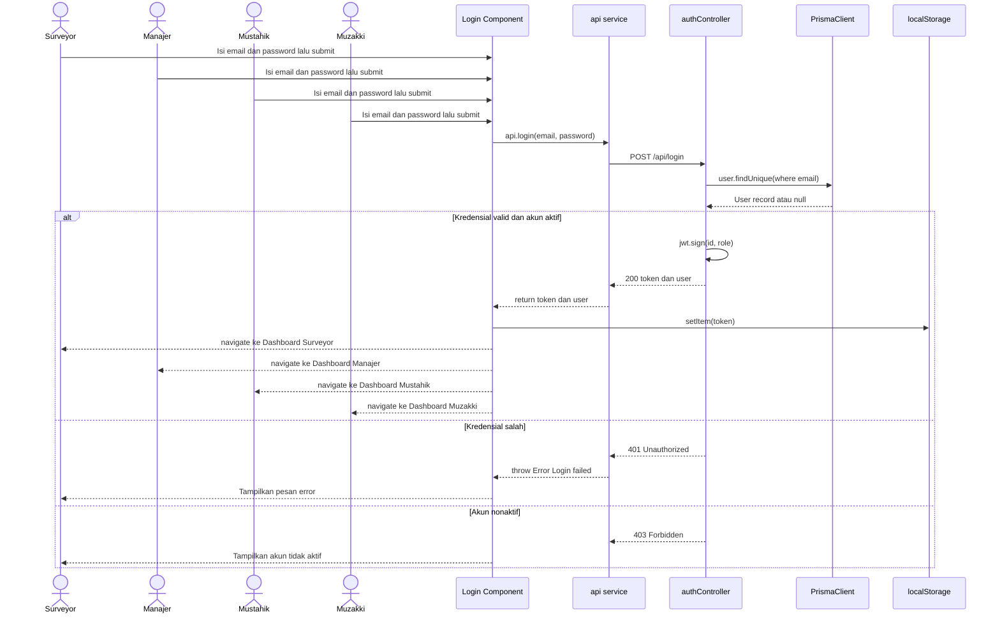
```mermaid
sequenceDiagram
    actor Surveyor
    actor Manajer
    actor Mustahik
    actor Muzakki
    participant Login as Login Component
    participant ApiSvc as api service
    participant AuthCtrl as authController
    participant Prisma as PrismaClient
    participant Store as localStorage

    Surveyor->>Login: Isi email dan password lalu submit
    Manajer->>Login: Isi email dan password lalu submit
    Mustahik->>Login: Isi email dan password lalu submit
    Muzakki->>Login: Isi email dan password lalu submit
    Login->>ApiSvc: api.login(email, password)
    ApiSvc->>AuthCtrl: POST /api/login
    AuthCtrl->>Prisma: user.findUnique(where email)
    Prisma-->>AuthCtrl: User record atau null

    alt Kredensial valid dan akun aktif
        AuthCtrl->>AuthCtrl: jwt.sign(id, role)
        AuthCtrl-->>ApiSvc: 200 token dan user
        ApiSvc-->>Login: return token dan user
        Login->>Store: setItem(token)
        Login-->>Surveyor: navigate ke Dashboard Surveyor
        Login-->>Manajer: navigate ke Dashboard Manajer
        Login-->>Mustahik: navigate ke Dashboard Mustahik
        Login-->>Muzakki: navigate ke Dashboard Muzakki
    else Kredensial salah
        AuthCtrl-->>ApiSvc: 401 Unauthorized
        ApiSvc-->>Login: throw Error Login failed
        Login-->>Surveyor: Tampilkan pesan error
    else Akun nonaktif
        AuthCtrl-->>ApiSvc: 403 Forbidden
        Login-->>Surveyor: Tampilkan akun tidak aktif
    end
```

---

## UC-02: Register Akun

> **Aktor:** Mustahik, Muzakki (Surveyor dan Manajer tidak bisa register mandiri)

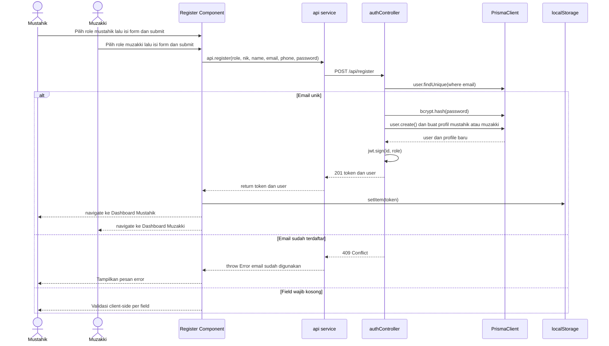
```mermaid
sequenceDiagram
    actor Mustahik
    actor Muzakki
    participant Reg as Register Component
    participant ApiSvc as api service
    participant AuthCtrl as authController
    participant Prisma as PrismaClient
    participant Store as localStorage

    Mustahik->>Reg: Pilih role mustahik lalu isi form dan submit
    Muzakki->>Reg: Pilih role muzakki lalu isi form dan submit
    Reg->>ApiSvc: api.register(role, nik, name, email, phone, password)
    ApiSvc->>AuthCtrl: POST /api/register
    AuthCtrl->>Prisma: user.findUnique(where email)

    alt Email unik
        AuthCtrl->>Prisma: bcrypt.hash(password)
        AuthCtrl->>Prisma: user.create() dan buat profil mustahik atau muzakki
        Prisma-->>AuthCtrl: user dan profile baru
        AuthCtrl->>AuthCtrl: jwt.sign(id, role)
        AuthCtrl-->>ApiSvc: 201 token dan user
        ApiSvc-->>Reg: return token dan user
        Reg->>Store: setItem(token)
        Reg-->>Mustahik: navigate ke Dashboard Mustahik
        Reg-->>Muzakki: navigate ke Dashboard Muzakki
    else Email sudah terdaftar
        AuthCtrl-->>ApiSvc: 409 Conflict
        ApiSvc-->>Reg: throw Error email sudah digunakan
        Reg-->>Mustahik: Tampilkan pesan error
    else Field wajib kosong
        Reg-->>Mustahik: Validasi client-side per field
    end
```

---

## UC-03: Lihat Dashboard

> **Aktor:** Semua role (konten menyesuaikan role masing-masing)

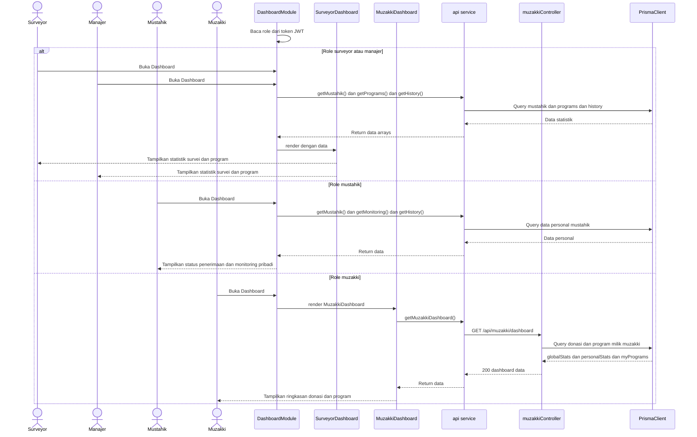
```mermaid
sequenceDiagram
    actor Surveyor
    actor Manajer
    actor Mustahik
    actor Muzakki
    participant DashMod as DashboardModule
    participant SurvDash as SurveyorDashboard
    participant MuzDash as MuzakkiDashboard
    participant ApiSvc as api service
    participant MuzCtrl as muzakkiController
    participant Prisma as PrismaClient

    DashMod->>DashMod: Baca role dari token JWT

    alt Role surveyor atau manajer
        Surveyor->>DashMod: Buka Dashboard
        Manajer->>DashMod: Buka Dashboard
        DashMod->>ApiSvc: getMustahik() dan getPrograms() dan getHistory()
        ApiSvc->>Prisma: Query mustahik dan programs dan history
        Prisma-->>ApiSvc: Data statistik
        ApiSvc-->>DashMod: Return data arrays
        DashMod->>SurvDash: render dengan data
        SurvDash-->>Surveyor: Tampilkan statistik survei dan program
        SurvDash-->>Manajer: Tampilkan statistik survei dan program
    else Role mustahik
        Mustahik->>DashMod: Buka Dashboard
        DashMod->>ApiSvc: getMustahik() dan getMonitoring() dan getHistory()
        ApiSvc->>Prisma: Query data personal mustahik
        Prisma-->>ApiSvc: Data personal
        ApiSvc-->>DashMod: Return data
        DashMod-->>Mustahik: Tampilkan status penerimaan dan monitoring pribadi
    else Role muzakki
        Muzakki->>DashMod: Buka Dashboard
        DashMod->>MuzDash: render MuzakkiDashboard
        MuzDash->>ApiSvc: getMuzakkiDashboard()
        ApiSvc->>MuzCtrl: GET /api/muzakki/dashboard
        MuzCtrl->>Prisma: Query donasi dan program milik muzakki
        Prisma-->>MuzCtrl: globalStats dan personalStats dan myPrograms
        MuzCtrl-->>ApiSvc: 200 dashboard data
        ApiSvc-->>MuzDash: Return data
        MuzDash-->>Muzakki: Tampilkan ringkasan donasi dan program
    end
```

---

## UC-04: Kelola Data Mustahik

> **Aktor:** Surveyor, Manajer (tambah/edit/hapus) — Mustahik (lihat data sendiri saja)

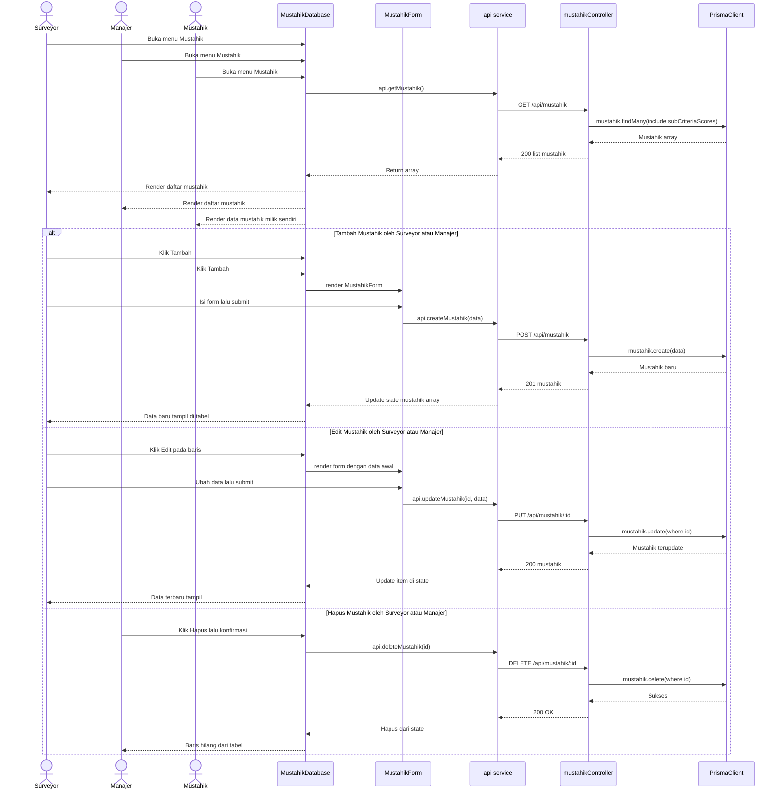
```mermaid
sequenceDiagram
    actor Surveyor
    actor Manajer
    actor Mustahik
    participant MustDB as MustahikDatabase
    participant MustForm as MustahikForm
    participant ApiSvc as api service
    participant MustCtrl as mustahikController
    participant Prisma as PrismaClient

    Surveyor->>MustDB: Buka menu Mustahik
    Manajer->>MustDB: Buka menu Mustahik
    Mustahik->>MustDB: Buka menu Mustahik
    MustDB->>ApiSvc: api.getMustahik()
    ApiSvc->>MustCtrl: GET /api/mustahik
    MustCtrl->>Prisma: mustahik.findMany(include subCriteriaScores)
    Prisma-->>MustCtrl: Mustahik array
    MustCtrl-->>ApiSvc: 200 list mustahik
    ApiSvc-->>MustDB: Return array
    MustDB-->>Surveyor: Render daftar mustahik
    MustDB-->>Manajer: Render daftar mustahik
    MustDB-->>Mustahik: Render data mustahik milik sendiri

    alt Tambah Mustahik oleh Surveyor atau Manajer
        Surveyor->>MustDB: Klik Tambah
        Manajer->>MustDB: Klik Tambah
        MustDB->>MustForm: render MustahikForm
        Surveyor->>MustForm: Isi form lalu submit
        MustForm->>ApiSvc: api.createMustahik(data)
        ApiSvc->>MustCtrl: POST /api/mustahik
        MustCtrl->>Prisma: mustahik.create(data)
        Prisma-->>MustCtrl: Mustahik baru
        MustCtrl-->>ApiSvc: 201 mustahik
        ApiSvc-->>MustDB: Update state mustahik array
        MustDB-->>Surveyor: Data baru tampil di tabel
    else Edit Mustahik oleh Surveyor atau Manajer
        Surveyor->>MustDB: Klik Edit pada baris
        MustDB->>MustForm: render form dengan data awal
        Surveyor->>MustForm: Ubah data lalu submit
        MustForm->>ApiSvc: api.updateMustahik(id, data)
        ApiSvc->>MustCtrl: PUT /api/mustahik/:id
        MustCtrl->>Prisma: mustahik.update(where id)
        Prisma-->>MustCtrl: Mustahik terupdate
        MustCtrl-->>ApiSvc: 200 mustahik
        ApiSvc-->>MustDB: Update item di state
        MustDB-->>Surveyor: Data terbaru tampil
    else Hapus Mustahik oleh Surveyor atau Manajer
        Manajer->>MustDB: Klik Hapus lalu konfirmasi
        MustDB->>ApiSvc: api.deleteMustahik(id)
        ApiSvc->>MustCtrl: DELETE /api/mustahik/:id
        MustCtrl->>Prisma: mustahik.delete(where id)
        Prisma-->>MustCtrl: Sukses
        MustCtrl-->>ApiSvc: 200 OK
        ApiSvc-->>MustDB: Hapus dari state
        MustDB-->>Manajer: Baris hilang dari tabel
    end
```

---

## UC-05: Input Survei dan Penilaian Kriteria

> **Aktor:** Surveyor, Manajer (Mustahik tidak bisa menilai kriteria)

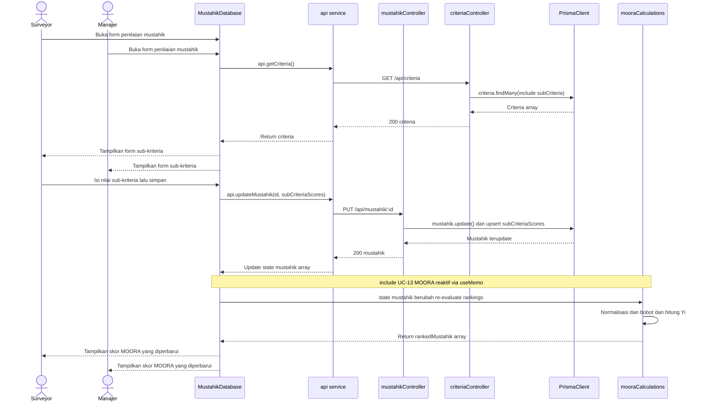
```mermaid
sequenceDiagram
    actor Surveyor
    actor Manajer
    participant MustDB as MustahikDatabase
    participant ApiSvc as api service
    participant MustCtrl as mustahikController
    participant CriCtrl as criteriaController
    participant Prisma as PrismaClient
    participant MooraFn as mooraCalculations

    Surveyor->>MustDB: Buka form penilaian mustahik
    Manajer->>MustDB: Buka form penilaian mustahik
    MustDB->>ApiSvc: api.getCriteria()
    ApiSvc->>CriCtrl: GET /api/criteria
    CriCtrl->>Prisma: criteria.findMany(include subCriteria)
    Prisma-->>CriCtrl: Criteria array
    CriCtrl-->>ApiSvc: 200 criteria
    ApiSvc-->>MustDB: Return criteria
    MustDB-->>Surveyor: Tampilkan form sub-kriteria
    MustDB-->>Manajer: Tampilkan form sub-kriteria

    Surveyor->>MustDB: Isi nilai sub-kriteria lalu simpan
    MustDB->>ApiSvc: api.updateMustahik(id, subCriteriaScores)
    ApiSvc->>MustCtrl: PUT /api/mustahik/:id
    MustCtrl->>Prisma: mustahik.update() dan upsert subCriteriaScores
    Prisma-->>MustCtrl: Mustahik terupdate
    MustCtrl-->>ApiSvc: 200 mustahik
    ApiSvc-->>MustDB: Update state mustahik array

    Note over MustDB,MooraFn: include UC-13 MOORA reaktif via useMemo
    MustDB->>MooraFn: state mustahik berubah re-evaluate rankings
    MooraFn->>MooraFn: Normalisasi dan bobot dan hitung Yi
    MooraFn-->>MustDB: Return rankedMustahik array
    MustDB-->>Surveyor: Tampilkan skor MOORA yang diperbarui
    MustDB-->>Manajer: Tampilkan skor MOORA yang diperbarui
```

---

## UC-06: Lihat Detail Mustahik

> **Aktor:** Surveyor, Manajer, Mustahik

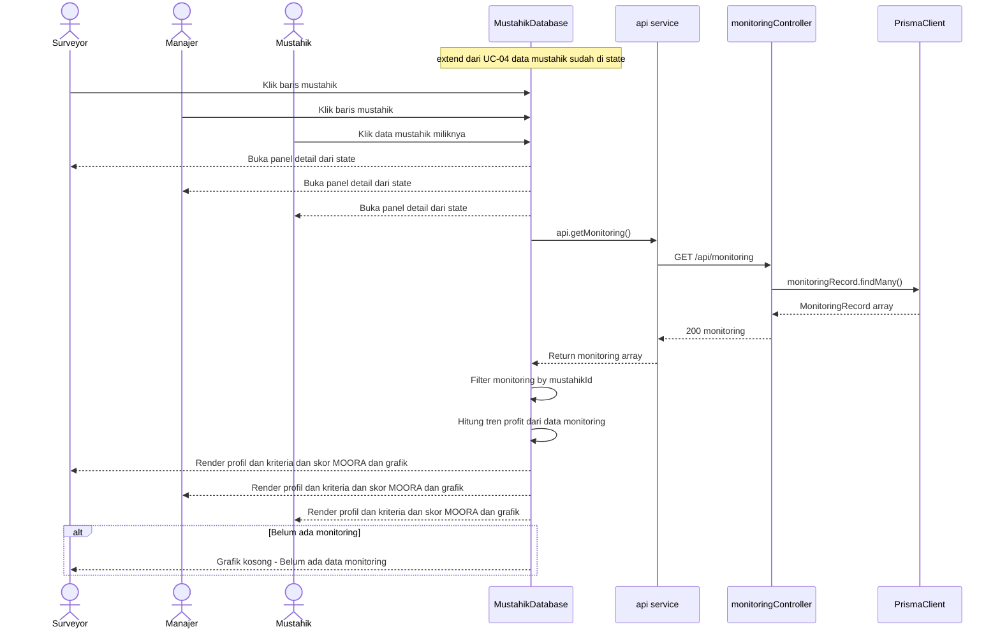
```mermaid
sequenceDiagram
    actor Surveyor
    actor Manajer
    actor Mustahik
    participant MustDB as MustahikDatabase
    participant ApiSvc as api service
    participant MonCtrl as monitoringController
    participant Prisma as PrismaClient

    Note over MustDB: extend dari UC-04 data mustahik sudah di state

    Surveyor->>MustDB: Klik baris mustahik
    Manajer->>MustDB: Klik baris mustahik
    Mustahik->>MustDB: Klik data mustahik miliknya
    MustDB-->>Surveyor: Buka panel detail dari state
    MustDB-->>Manajer: Buka panel detail dari state
    MustDB-->>Mustahik: Buka panel detail dari state

    MustDB->>ApiSvc: api.getMonitoring()
    ApiSvc->>MonCtrl: GET /api/monitoring
    MonCtrl->>Prisma: monitoringRecord.findMany()
    Prisma-->>MonCtrl: MonitoringRecord array
    MonCtrl-->>ApiSvc: 200 monitoring
    ApiSvc-->>MustDB: Return monitoring array
    MustDB->>MustDB: Filter monitoring by mustahikId
    MustDB->>MustDB: Hitung tren profit dari data monitoring
    MustDB-->>Surveyor: Render profil dan kriteria dan skor MOORA dan grafik
    MustDB-->>Manajer: Render profil dan kriteria dan skor MOORA dan grafik
    MustDB-->>Mustahik: Render profil dan kriteria dan skor MOORA dan grafik

    alt Belum ada monitoring
        MustDB-->>Surveyor: Grafik kosong - Belum ada data monitoring
    end
```

---

## UC-07: Filter dan Cari Mustahik

> **Aktor:** Surveyor, Manajer, Mustahik

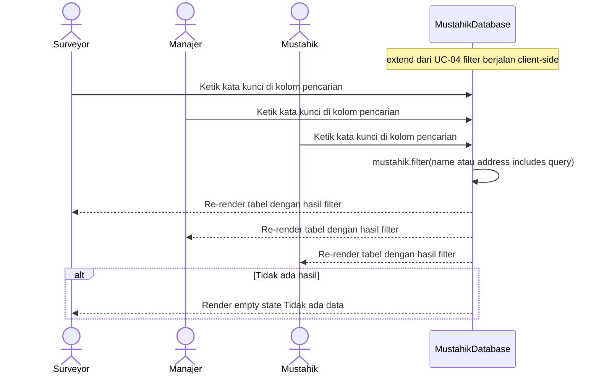
```mermaid
sequenceDiagram
    actor Surveyor
    actor Manajer
    actor Mustahik
    participant MustDB as MustahikDatabase

    Note over MustDB: extend dari UC-04 filter berjalan client-side

    Surveyor->>MustDB: Ketik kata kunci di kolom pencarian
    Manajer->>MustDB: Ketik kata kunci di kolom pencarian
    Mustahik->>MustDB: Ketik kata kunci di kolom pencarian
    MustDB->>MustDB: mustahik.filter(name atau address includes query)
    MustDB-->>Surveyor: Re-render tabel dengan hasil filter
    MustDB-->>Manajer: Re-render tabel dengan hasil filter
    MustDB-->>Mustahik: Re-render tabel dengan hasil filter

    alt Tidak ada hasil
        MustDB-->>Surveyor: Render empty state Tidak ada data
    end
```

---

## UC-08: Kelola Data Muzakki

> **Aktor:** Manajer (kelola semua akun muzakki) + Muzakki (kelola data sendiri)

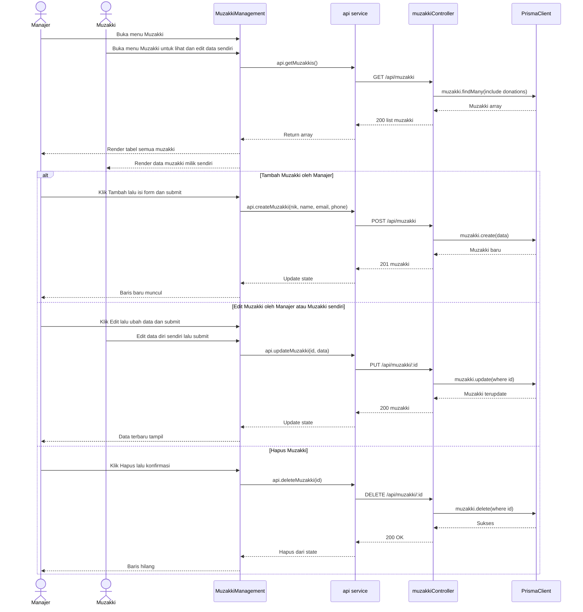
```mermaid
sequenceDiagram
    actor Manajer
    actor Muzakki
    participant MuzMgmt as MuzakkiManagement
    participant ApiSvc as api service
    participant MuzCtrl as muzakkiController
    participant Prisma as PrismaClient

    Manajer->>MuzMgmt: Buka menu Muzakki
    Muzakki->>MuzMgmt: Buka menu Muzakki untuk lihat dan edit data sendiri
    MuzMgmt->>ApiSvc: api.getMuzakkis()
    ApiSvc->>MuzCtrl: GET /api/muzakki
    MuzCtrl->>Prisma: muzakki.findMany(include donations)
    Prisma-->>MuzCtrl: Muzakki array
    MuzCtrl-->>ApiSvc: 200 list muzakki
    ApiSvc-->>MuzMgmt: Return array
    MuzMgmt-->>Manajer: Render tabel semua muzakki
    MuzMgmt-->>Muzakki: Render data muzakki milik sendiri

    alt Tambah Muzakki oleh Manajer
        Manajer->>MuzMgmt: Klik Tambah lalu isi form dan submit
        MuzMgmt->>ApiSvc: api.createMuzakki(nik, name, email, phone)
        ApiSvc->>MuzCtrl: POST /api/muzakki
        MuzCtrl->>Prisma: muzakki.create(data)
        Prisma-->>MuzCtrl: Muzakki baru
        MuzCtrl-->>ApiSvc: 201 muzakki
        ApiSvc-->>MuzMgmt: Update state
        MuzMgmt-->>Manajer: Baris baru muncul
    else Edit Muzakki oleh Manajer atau Muzakki sendiri
        Manajer->>MuzMgmt: Klik Edit lalu ubah data dan submit
        Muzakki->>MuzMgmt: Edit data diri sendiri lalu submit
        MuzMgmt->>ApiSvc: api.updateMuzakki(id, data)
        ApiSvc->>MuzCtrl: PUT /api/muzakki/:id
        MuzCtrl->>Prisma: muzakki.update(where id)
        Prisma-->>MuzCtrl: Muzakki terupdate
        MuzCtrl-->>ApiSvc: 200 muzakki
        ApiSvc-->>MuzMgmt: Update state
        MuzMgmt-->>Manajer: Data terbaru tampil
    else Hapus Muzakki
        Manajer->>MuzMgmt: Klik Hapus lalu konfirmasi
        MuzMgmt->>ApiSvc: api.deleteMuzakki(id)
        ApiSvc->>MuzCtrl: DELETE /api/muzakki/:id
        MuzCtrl->>Prisma: muzakki.delete(where id)
        Prisma-->>MuzCtrl: Sukses
        MuzCtrl-->>ApiSvc: 200 OK
        ApiSvc-->>MuzMgmt: Hapus dari state
        MuzMgmt-->>Manajer: Baris hilang
    end
```

---

## UC-09: Catat Donasi oleh Muzakki via Midtrans Snap

> **Aktor:** Muzakki (donasi mandiri via Midtrans)

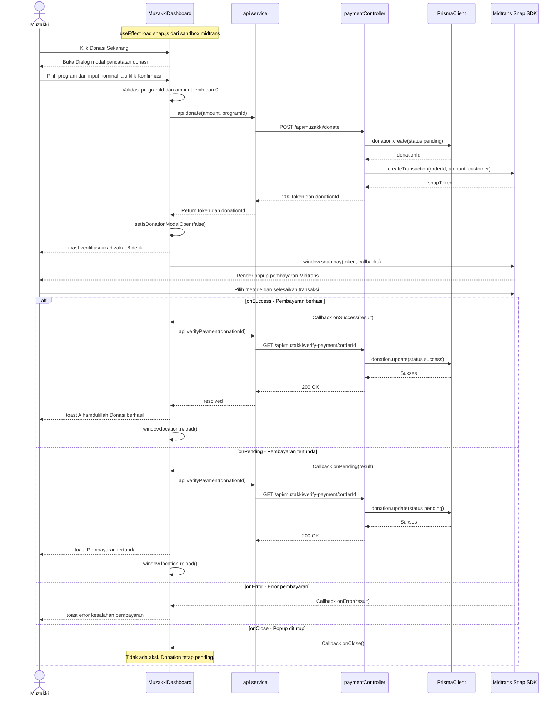
```mermaid
sequenceDiagram
    actor Muzakki
    participant MuzDash as MuzakkiDashboard
    participant ApiSvc as api service
    participant PayCtrl as paymentController
    participant Prisma as PrismaClient
    participant Snap as Midtrans Snap SDK

    Note over MuzDash: useEffect load snap.js dari sandbox midtrans

    Muzakki->>MuzDash: Klik Donasi Sekarang
    MuzDash-->>Muzakki: Buka Dialog modal pencatatan donasi

    Muzakki->>MuzDash: Pilih program dan input nominal lalu klik Konfirmasi
    MuzDash->>MuzDash: Validasi programId dan amount lebih dari 0

    MuzDash->>ApiSvc: api.donate(amount, programId)
    ApiSvc->>PayCtrl: POST /api/muzakki/donate
    PayCtrl->>Prisma: donation.create(status pending)
    Prisma-->>PayCtrl: donationId
    PayCtrl->>Snap: createTransaction(orderId, amount, customer)
    Snap-->>PayCtrl: snapToken
    PayCtrl-->>ApiSvc: 200 token dan donationId
    ApiSvc-->>MuzDash: Return token dan donationId

    MuzDash->>MuzDash: setIsDonationModalOpen(false)
    MuzDash-->>Muzakki: toast verifikasi akad zakat 8 detik
    MuzDash->>Snap: window.snap.pay(token, callbacks)
    Snap-->>Muzakki: Render popup pembayaran Midtrans

    Muzakki->>Snap: Pilih metode dan selesaikan transaksi

    alt onSuccess - Pembayaran berhasil
        Snap-->>MuzDash: Callback onSuccess(result)
        MuzDash->>ApiSvc: api.verifyPayment(donationId)
        ApiSvc->>PayCtrl: GET /api/muzakki/verify-payment/:orderId
        PayCtrl->>Prisma: donation.update(status success)
        Prisma-->>PayCtrl: Sukses
        PayCtrl-->>ApiSvc: 200 OK
        ApiSvc-->>MuzDash: resolved
        MuzDash-->>Muzakki: toast Alhamdulillah Donasi berhasil
        MuzDash->>MuzDash: window.location.reload()
    else onPending - Pembayaran tertunda
        Snap-->>MuzDash: Callback onPending(result)
        MuzDash->>ApiSvc: api.verifyPayment(donationId)
        ApiSvc->>PayCtrl: GET /api/muzakki/verify-payment/:orderId
        PayCtrl->>Prisma: donation.update(status pending)
        Prisma-->>PayCtrl: Sukses
        PayCtrl-->>ApiSvc: 200 OK
        MuzDash-->>Muzakki: toast Pembayaran tertunda
        MuzDash->>MuzDash: window.location.reload()
    else onError - Error pembayaran
        Snap-->>MuzDash: Callback onError(result)
        MuzDash-->>Muzakki: toast error kesalahan pembayaran
    else onClose - Popup ditutup
        Snap-->>MuzDash: Callback onClose()
        Note over MuzDash: Tidak ada aksi. Donation tetap pending.
    end
```

---

## UC-09b: Catat Donasi oleh Manajer

> **Aktor:** Manajer (input donasi langsung tanpa Midtrans)

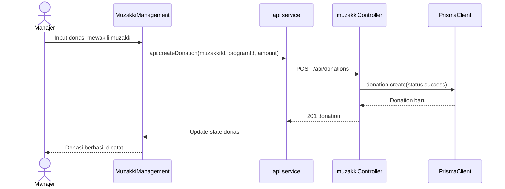
```mermaid
sequenceDiagram
    actor Manajer
    participant MuzMgmt as MuzakkiManagement
    participant ApiSvc as api service
    participant MuzCtrl as muzakkiController
    participant Prisma as PrismaClient

    Manajer->>MuzMgmt: Input donasi mewakili muzakki
    MuzMgmt->>ApiSvc: api.createDonation(muzakkiId, programId, amount)
    ApiSvc->>MuzCtrl: POST /api/donations
    MuzCtrl->>Prisma: donation.create(status success)
    Prisma-->>MuzCtrl: Donation baru
    MuzCtrl-->>ApiSvc: 201 donation
    ApiSvc-->>MuzMgmt: Update state donasi
    MuzMgmt-->>Manajer: Donasi berhasil dicatat
```

---

## UC-10: Lihat Riwayat Donasi

> **Aktor:** Surveyor, Manajer (lihat semua donasi) — Muzakki (lihat donasi sendiri)

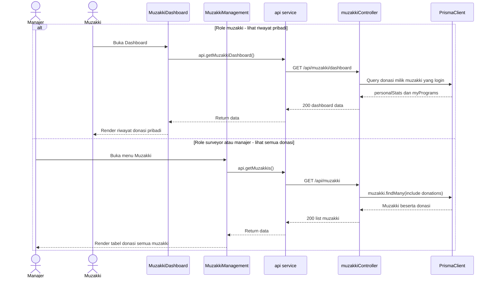
```mermaid
sequenceDiagram
    actor Manajer
    actor Muzakki
    participant MuzDash as MuzakkiDashboard
    participant MuzMgmt as MuzakkiManagement
    participant ApiSvc as api service
    participant MuzCtrl as muzakkiController
    participant Prisma as PrismaClient

    alt Role muzakki - lihat riwayat pribadi
        Muzakki->>MuzDash: Buka Dashboard
        MuzDash->>ApiSvc: api.getMuzakkiDashboard()
        ApiSvc->>MuzCtrl: GET /api/muzakki/dashboard
        MuzCtrl->>Prisma: Query donasi milik muzakki yang login
        Prisma-->>MuzCtrl: personalStats dan myPrograms
        MuzCtrl-->>ApiSvc: 200 dashboard data
        ApiSvc-->>MuzDash: Return data
        MuzDash-->>Muzakki: Render riwayat donasi pribadi
    else Role surveyor atau manajer - lihat semua donasi
        Manajer->>MuzMgmt: Buka menu Muzakki
        MuzMgmt->>ApiSvc: api.getMuzakkis()
        ApiSvc->>MuzCtrl: GET /api/muzakki
        MuzCtrl->>Prisma: muzakki.findMany(include donations)
        Prisma-->>MuzCtrl: Muzakki beserta donasi
        MuzCtrl-->>ApiSvc: 200 list muzakki
        ApiSvc-->>MuzMgmt: Return data
        MuzMgmt-->>Manajer: Render tabel donasi semua muzakki
    end
```

---

## UC-11: Kelola Program Bantuan

> **Aktor:** Manajer

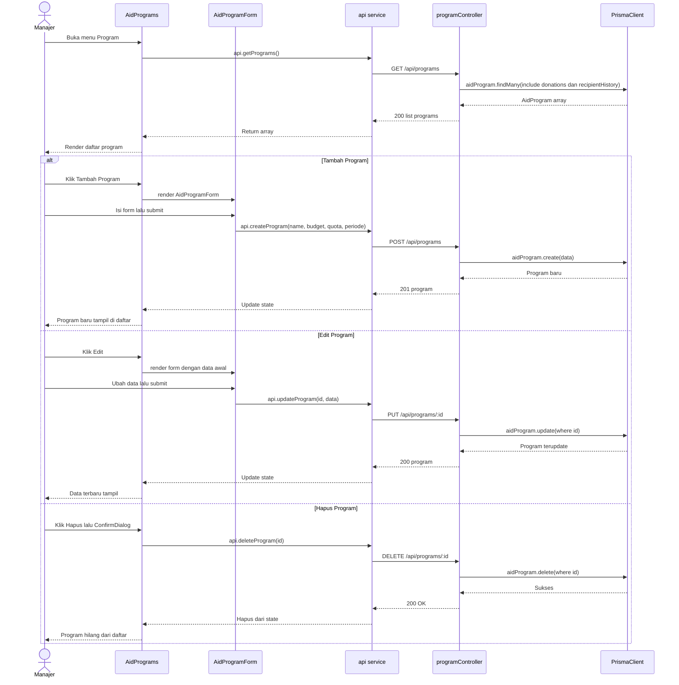
```mermaid
sequenceDiagram
    actor Manajer
    participant AidProg as AidPrograms
    participant AidForm as AidProgramForm
    participant ApiSvc as api service
    participant ProgCtrl as programController
    participant Prisma as PrismaClient
    Manajer->>AidProg: Buka menu Program
    AidProg->>ApiSvc: api.getPrograms()
    ApiSvc->>ProgCtrl: GET /api/programs
    ProgCtrl->>Prisma: aidProgram.findMany(include donations dan recipientHistory)
    Prisma-->>ProgCtrl: AidProgram array
    ProgCtrl-->>ApiSvc: 200 list programs
    ApiSvc-->>AidProg: Return array
    AidProg-->>Manajer: Render daftar program

    alt Tambah Program
        Manajer->>AidProg: Klik Tambah Program
        AidProg->>AidForm: render AidProgramForm
        Manajer->>AidForm: Isi form lalu submit
        AidForm->>ApiSvc: api.createProgram(name, budget, quota, periode)
        ApiSvc->>ProgCtrl: POST /api/programs
        ProgCtrl->>Prisma: aidProgram.create(data)
        Prisma-->>ProgCtrl: Program baru
        ProgCtrl-->>ApiSvc: 201 program
        ApiSvc-->>AidProg: Update state
        AidProg-->>Manajer: Program baru tampil di daftar
    else Edit Program
        Manajer->>AidProg: Klik Edit
        AidProg->>AidForm: render form dengan data awal
        Manajer->>AidForm: Ubah data lalu submit
        AidForm->>ApiSvc: api.updateProgram(id, data)
        ApiSvc->>ProgCtrl: PUT /api/programs/:id
        ProgCtrl->>Prisma: aidProgram.update(where id)
        Prisma-->>ProgCtrl: Program terupdate
        ProgCtrl-->>ApiSvc: 200 program
        ApiSvc-->>AidProg: Update state
        AidProg-->>Manajer: Data terbaru tampil
    else Hapus Program
        Manajer->>AidProg: Klik Hapus lalu ConfirmDialog
        AidProg->>ApiSvc: api.deleteProgram(id)
        ApiSvc->>ProgCtrl: DELETE /api/programs/:id
        ProgCtrl->>Prisma: aidProgram.delete(where id)
        Prisma-->>ProgCtrl: Sukses
        ProgCtrl-->>ApiSvc: 200 OK
        ApiSvc-->>AidProg: Hapus dari state
        AidProg-->>Manajer: Program hilang dari daftar
    end
```

---

## UC-12: Kelola Calon dan Penerima Program

> **Aktor:** Manajer

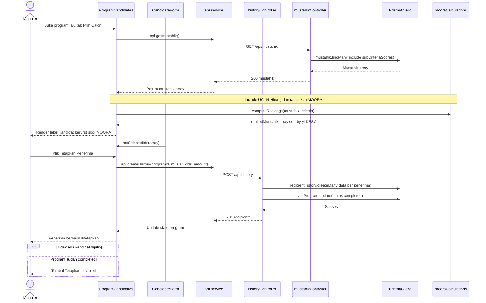
```mermaid
sequenceDiagram
    actor Manajer
    participant ProgCand as ProgramCandidates
    participant CandForm as CandidateForm
    participant ApiSvc as api service
    participant HistCtrl as historyController
    participant MustCtrl as mustahikController
    participant Prisma as PrismaClient
    participant MooraFn as mooraCalculations

    Manajer->>ProgCand: Buka program lalu tab Pilih Calon
    ProgCand->>ApiSvc: api.getMustahik()
    ApiSvc->>MustCtrl: GET /api/mustahik
    MustCtrl->>Prisma: mustahik.findMany(include subCriteriaScores)
    Prisma-->>MustCtrl: Mustahik array
    MustCtrl-->>ApiSvc: 200 mustahik
    ApiSvc-->>ProgCand: Return mustahik array

    Note over ProgCand,MooraFn: include UC-14 Hitung dan tampilkan MOORA
    ProgCand->>MooraFn: computeRankings(mustahik, criteria)
    MooraFn-->>ProgCand: rankedMustahik array sort by yi DESC
    ProgCand-->>Manajer: Render tabel kandidat berurut skor MOORA

    CandForm->>ProgCand: setSelectedIds(array)

    Manajer->>ProgCand: Klik Tetapkan Penerima
    ProgCand->>ApiSvc: api.createHistory(programId, mustahikIds, amount)
    ApiSvc->>HistCtrl: POST /api/history
    HistCtrl->>Prisma: recipientHistory.createMany(data per penerima)
    HistCtrl->>Prisma: aidProgram.update(status completed)
    Prisma-->>HistCtrl: Sukses
    HistCtrl-->>ApiSvc: 201 recipients
    ApiSvc-->>ProgCand: Update state program
    ProgCand-->>Manajer: Penerima berhasil ditetapkan

    alt Tidak ada kandidat dipilih
    else Program sudah completed
        ProgCand-->>Manajer: Tombol Tetapkan disabled
    end
```

---

## UC-13: Hitung Perangkingan MOORA

> **Aktor:** Sistem (otomatis, tidak ada interaksi user langsung)

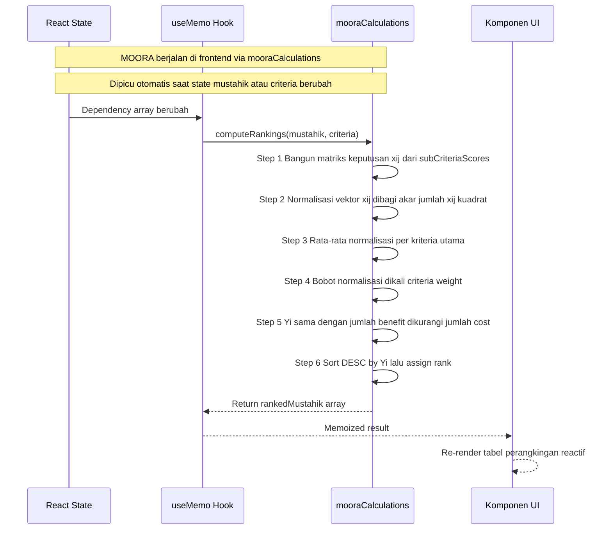
```mermaid
sequenceDiagram
    participant StateChg as React State
    participant UseMemo as useMemo Hook
    participant MooraFn as mooraCalculations
    participant UI as Komponen UI

    Note over StateChg,MooraFn: MOORA berjalan di frontend via mooraCalculations
    Note over StateChg,MooraFn: Dipicu otomatis saat state mustahik atau criteria berubah

    StateChg->>UseMemo: Dependency array berubah
    UseMemo->>MooraFn: computeRankings(mustahik, criteria)

    MooraFn->>MooraFn: Step 1 Bangun matriks keputusan xij dari subCriteriaScores
    MooraFn->>MooraFn: Step 2 Normalisasi vektor xij dibagi akar jumlah xij kuadrat
    MooraFn->>MooraFn: Step 3 Rata-rata normalisasi per kriteria utama
    MooraFn->>MooraFn: Step 4 Bobot normalisasi dikali criteria weight
    MooraFn->>MooraFn: Step 5 Yi sama dengan jumlah benefit dikurangi jumlah cost
    MooraFn->>MooraFn: Step 6 Sort DESC by Yi lalu assign rank

    MooraFn-->>UseMemo: Return rankedMustahik array
    UseMemo-->>UI: Memoized result
    UI-->>UI: Re-render tabel perangkingan reactif
```

---

## UC-14: Lihat Hasil Perangkingan

> **Aktor:** Manajer

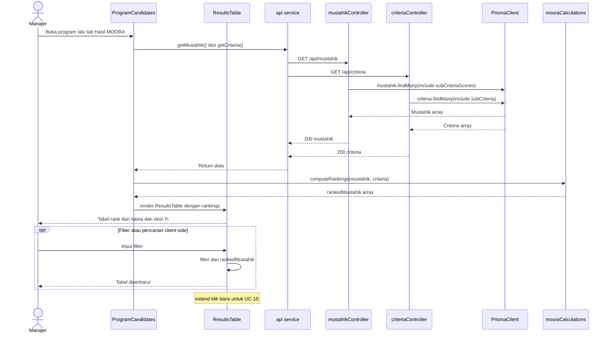
```mermaid
sequenceDiagram
    actor Manajer
    participant ProgCand as ProgramCandidates
    participant ResTbl as ResultsTable
    participant ApiSvc as api service
    participant MustCtrl as mustahikController
    participant CriCtrl as criteriaController
    participant Prisma as PrismaClient
    participant MooraFn as mooraCalculations

    Manajer->>ProgCand: Buka program lalu tab Hasil MOORA
    ProgCand->>ApiSvc: getMustahik() dan getCriteria()
    ApiSvc->>MustCtrl: GET /api/mustahik
    ApiSvc->>CriCtrl: GET /api/criteria
    MustCtrl->>Prisma: mustahik.findMany(include subCriteriaScores)
    CriCtrl->>Prisma: criteria.findMany(include subCriteria)
    Prisma-->>MustCtrl: Mustahik array
    Prisma-->>CriCtrl: Criteria array
    MustCtrl-->>ApiSvc: 200 mustahik
    CriCtrl-->>ApiSvc: 200 criteria
    ApiSvc-->>ProgCand: Return data

    ProgCand->>MooraFn: computeRankings(mustahik, criteria)
    MooraFn-->>ProgCand: rankedMustahik array

    ProgCand->>ResTbl: render ResultsTable dengan rankings
    ResTbl-->>Manajer: Tabel rank dan nama dan skor Yi

    opt Filter atau pencarian client-side
        Manajer->>ResTbl: Input filter
        ResTbl->>ResTbl: filter dari rankedMustahik
        ResTbl-->>Manajer: Tabel diperbarui
    end

    Note over ResTbl: extend klik baris untuk UC-15
```

---

## UC-15: Lihat Detail Perhitungan

> **Aktor:** Manajer

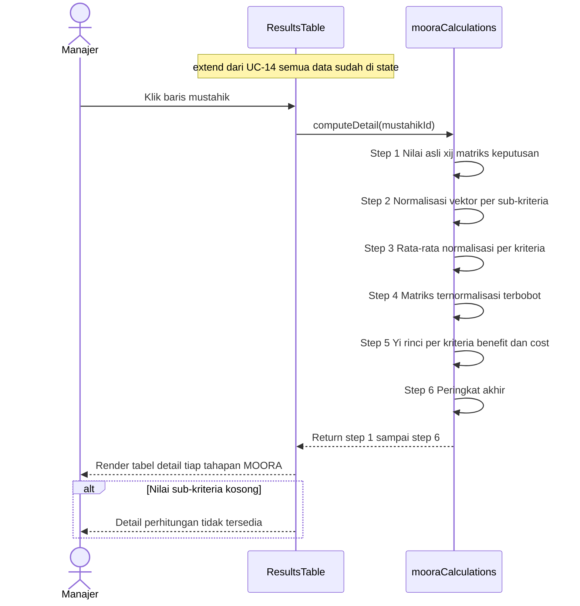
```mermaid
sequenceDiagram
    actor Manajer
    participant ResTbl as ResultsTable
    participant MooraFn as mooraCalculations

    Note over ResTbl: extend dari UC-14 semua data sudah di state

    Manajer->>ResTbl: Klik baris mustahik
    ResTbl->>MooraFn: computeDetail(mustahikId)
    MooraFn->>MooraFn: Step 1 Nilai asli xij matriks keputusan
    MooraFn->>MooraFn: Step 2 Normalisasi vektor per sub-kriteria
    MooraFn->>MooraFn: Step 3 Rata-rata normalisasi per kriteria
    MooraFn->>MooraFn: Step 4 Matriks ternormalisasi terbobot
    MooraFn->>MooraFn: Step 5 Yi rinci per kriteria benefit dan cost
    MooraFn->>MooraFn: Step 6 Peringkat akhir
    MooraFn-->>ResTbl: Return step 1 sampai step 6

    ResTbl-->>Manajer: Render tabel detail tiap tahapan MOORA

    alt Nilai sub-kriteria kosong
        ResTbl-->>Manajer: Detail perhitungan tidak tersedia
    end
```

---

## UC-16: Kelola Kriteria dan Bobot

> **Aktor:** Manajer

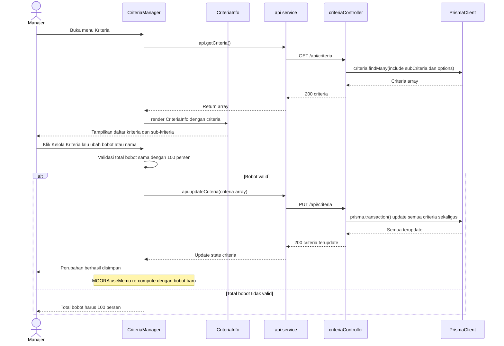
```mermaid
sequenceDiagram
    actor Manajer
    participant CritMgr as CriteriaManager
    participant CritInfo as CriteriaInfo
    participant ApiSvc as api service
    participant CriCtrl as criteriaController
    participant Prisma as PrismaClient

    Manajer->>CritMgr: Buka menu Kriteria
    CritMgr->>ApiSvc: api.getCriteria()
    ApiSvc->>CriCtrl: GET /api/criteria
    CriCtrl->>Prisma: criteria.findMany(include subCriteria dan options)
    Prisma-->>CriCtrl: Criteria array
    CriCtrl-->>ApiSvc: 200 criteria
    ApiSvc-->>CritMgr: Return array
    CritMgr->>CritInfo: render CriteriaInfo dengan criteria
    CritInfo-->>Manajer: Tampilkan daftar kriteria dan sub-kriteria

    Manajer->>CritMgr: Klik Kelola Kriteria lalu ubah bobot atau nama
    CritMgr->>CritMgr: Validasi total bobot sama dengan 100 persen

    alt Bobot valid
        CritMgr->>ApiSvc: api.updateCriteria(criteria array)
        ApiSvc->>CriCtrl: PUT /api/criteria
        CriCtrl->>Prisma: prisma.transaction() update semua criteria sekaligus
        Prisma-->>CriCtrl: Semua terupdate
        CriCtrl-->>ApiSvc: 200 criteria terupdate
        ApiSvc-->>CritMgr: Update state criteria
        CritMgr-->>Manajer: Perubahan berhasil disimpan
        Note over CritMgr: MOORA useMemo re-compute dengan bobot baru
    else Total bobot tidak valid
        CritMgr-->>Manajer: Total bobot harus 100 persen
    end
```

---

## UC-17: Input Data Monitoring

> **Aktor:** Surveyor, Manajer, Mustahik

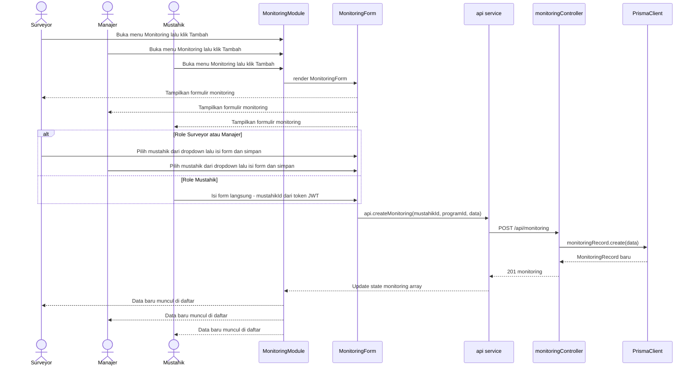
```mermaid
sequenceDiagram
    actor Surveyor
    actor Manajer
    actor Mustahik
    participant MonMod as MonitoringModule
    participant MonForm as MonitoringForm
    participant ApiSvc as api service
    participant MonCtrl as monitoringController
    participant Prisma as PrismaClient

    Surveyor->>MonMod: Buka menu Monitoring lalu klik Tambah
    Manajer->>MonMod: Buka menu Monitoring lalu klik Tambah
    Mustahik->>MonMod: Buka menu Monitoring lalu klik Tambah
    MonMod->>MonForm: render MonitoringForm
    MonForm-->>Surveyor: Tampilkan formulir monitoring
    MonForm-->>Manajer: Tampilkan formulir monitoring
    MonForm-->>Mustahik: Tampilkan formulir monitoring

    alt Role Surveyor atau Manajer
        Surveyor->>MonForm: Pilih mustahik dari dropdown lalu isi form dan simpan
        Manajer->>MonForm: Pilih mustahik dari dropdown lalu isi form dan simpan
    else Role Mustahik
        Mustahik->>MonForm: Isi form langsung - mustahikId dari token JWT
    end

    MonForm->>ApiSvc: api.createMonitoring(mustahikId, programId, data)
    ApiSvc->>MonCtrl: POST /api/monitoring
    MonCtrl->>Prisma: monitoringRecord.create(data)
    Prisma-->>MonCtrl: MonitoringRecord baru
    MonCtrl-->>ApiSvc: 201 monitoring
    ApiSvc-->>MonMod: Update state monitoring array
    MonMod-->>Surveyor: Data baru muncul di daftar
    MonMod-->>Manajer: Data baru muncul di daftar
    MonMod-->>Mustahik: Data baru muncul di daftar
```

---

## UC-18: Lihat Riwayat Monitoring

> **Aktor:** Surveyor, Manajer, Mustahik

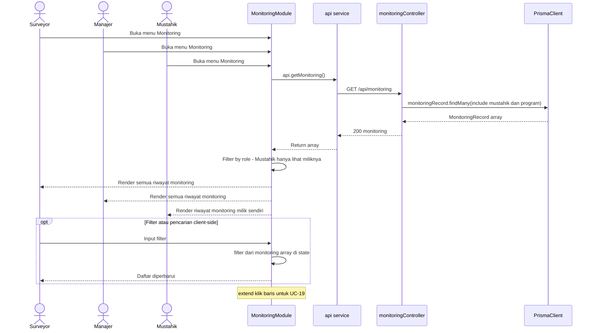
```mermaid
sequenceDiagram
    actor Surveyor
    actor Manajer
    actor Mustahik
    participant MonMod as MonitoringModule
    participant ApiSvc as api service
    participant MonCtrl as monitoringController
    participant Prisma as PrismaClient

    Surveyor->>MonMod: Buka menu Monitoring
    Manajer->>MonMod: Buka menu Monitoring
    Mustahik->>MonMod: Buka menu Monitoring
    MonMod->>ApiSvc: api.getMonitoring()
    ApiSvc->>MonCtrl: GET /api/monitoring
    MonCtrl->>Prisma: monitoringRecord.findMany(include mustahik dan program)
    Prisma-->>MonCtrl: MonitoringRecord array
    MonCtrl-->>ApiSvc: 200 monitoring
    ApiSvc-->>MonMod: Return array

    MonMod->>MonMod: Filter by role - Mustahik hanya lihat miliknya
    MonMod-->>Surveyor: Render semua riwayat monitoring
    MonMod-->>Manajer: Render semua riwayat monitoring
    MonMod-->>Mustahik: Render riwayat monitoring milik sendiri

    opt Filter atau pencarian client-side
        Surveyor->>MonMod: Input filter
        MonMod->>MonMod: filter dari monitoring array di state
        MonMod-->>Surveyor: Daftar diperbarui
    end

    Note over MonMod: extend klik baris untuk UC-19
```

---

## UC-19: Lihat Detail Monitoring

> **Aktor:** Surveyor, Manajer, Mustahik

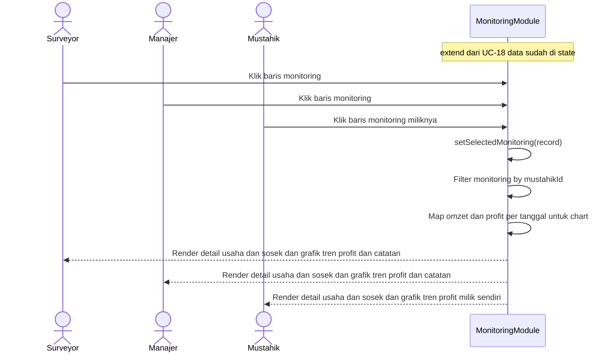
```mermaid
sequenceDiagram
    actor Surveyor
    actor Manajer
    actor Mustahik
    participant MonMod as MonitoringModule

    Note over MonMod: extend dari UC-18 data sudah di state

    Surveyor->>MonMod: Klik baris monitoring
    Manajer->>MonMod: Klik baris monitoring
    Mustahik->>MonMod: Klik baris monitoring miliknya
    MonMod->>MonMod: setSelectedMonitoring(record)
    MonMod->>MonMod: Filter monitoring by mustahikId
    MonMod->>MonMod: Map omzet dan profit per tanggal untuk chart
    MonMod-->>Surveyor: Render detail usaha dan sosek dan grafik tren profit dan catatan
    MonMod-->>Manajer: Render detail usaha dan sosek dan grafik tren profit dan catatan
    MonMod-->>Mustahik: Render detail usaha dan sosek dan grafik tren profit milik sendiri
```

---

## UC-20: Kelola Pengguna

> **Aktor:** Manajer

```mermaid
sequenceDiagram
    actor Manajer
    participant UserMgmt as UserManagement
    participant ApiSvc as api service
    participant UserCtrl as userController
    participant Prisma as PrismaClient

    Manajer->>UserMgmt: Buka menu Pengguna
    UserMgmt->>ApiSvc: api.getUsers()
    ApiSvc->>UserCtrl: GET /api/users
    UserCtrl->>Prisma: user.findMany(select id name email role isActive)
    Prisma-->>UserCtrl: User array
    UserCtrl-->>ApiSvc: 200 users
    ApiSvc-->>UserMgmt: Return array
    UserMgmt-->>Manajer: Render daftar pengguna

    alt Tambah Pengguna
        Manajer->>UserMgmt: Klik Tambah lalu isi form dan submit
        UserMgmt->>ApiSvc: api.addUser(name, email, password, role)
        ApiSvc->>UserCtrl: POST /api/users
        UserCtrl->>Prisma: bcrypt.hash(password) lalu user.create(data)
        Prisma-->>UserCtrl: User baru
        UserCtrl-->>ApiSvc: 201 user
        ApiSvc-->>UserMgmt: Update state
        UserMgmt-->>Manajer: Pengguna baru ditambahkan
    else Edit atau Toggle isActive
        Manajer->>UserMgmt: Klik Edit lalu ubah data dan submit
        UserMgmt->>ApiSvc: api.updateUser(id, data, isActive)
        ApiSvc->>UserCtrl: PUT /api/users/:id
        UserCtrl->>Prisma: user.update(where id)
        Prisma-->>UserCtrl: User terupdate
        UserCtrl-->>ApiSvc: 200 user
        ApiSvc-->>UserMgmt: Update state
        UserMgmt-->>Manajer: Data terbaru tampil
    else Hapus Pengguna
        Manajer->>UserMgmt: Klik Hapus lalu ConfirmDialog
        UserMgmt->>ApiSvc: api.deleteUser(id)
        ApiSvc->>UserCtrl: DELETE /api/users/:id
        UserCtrl->>Prisma: user.delete(where id)
        Prisma-->>UserCtrl: Sukses
        UserCtrl-->>ApiSvc: 200 OK
        ApiSvc-->>UserMgmt: Hapus dari state
        UserMgmt-->>Manajer: Pengguna dihapus
    end
```

---

## UC-21: Lihat Riwayat Penerimaan

> **Aktor:** Surveyor, Manajer, Mustahik, Muzakki

```mermaid
sequenceDiagram
    actor Surveyor
    actor Manajer
    actor Mustahik
    actor Muzakki
    participant RecTrack as RecipientTracking
    participant ApiSvc as api service
    participant HistCtrl as historyController
    participant Prisma as PrismaClient

    Surveyor->>RecTrack: Buka menu Tracking
    Manajer->>RecTrack: Buka menu Tracking
    Mustahik->>RecTrack: Buka menu Tracking
    Muzakki->>RecTrack: Buka menu Tracking
    RecTrack->>ApiSvc: api.getHistory()
    ApiSvc->>HistCtrl: GET /api/history
    HistCtrl->>Prisma: recipientHistory.findMany(include mustahik dan program, orderBy receivedDate)
    Prisma-->>HistCtrl: RecipientHistory array
    HistCtrl-->>ApiSvc: 200 history
    ApiSvc-->>RecTrack: Return array

    RecTrack->>RecTrack: Filter by role - Mustahik dan Muzakki hanya lihat miliknya
    RecTrack-->>Surveyor: Render semua riwayat penerimaan bantuan
    RecTrack-->>Manajer: Render semua riwayat penerimaan bantuan
    RecTrack-->>Mustahik: Render riwayat penerimaan bantuan milik sendiri
    RecTrack-->>Muzakki: Render riwayat penerimaan bantuan yang terhubung dengan donasinya

    opt Pencarian client-side
        Surveyor->>RecTrack: Input kata kunci
        RecTrack->>RecTrack: filter by mustahik.name atau program.name
        RecTrack-->>Surveyor: Tabel diperbarui
    end

    alt Belum ada penerima ditetapkan
        RecTrack-->>Mustahik: Render empty state dengan keterangan
    end
```
