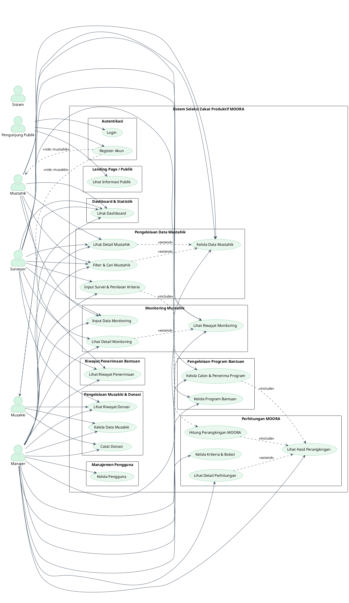

# Use Case Diagram — Sistem Seleksi Zakat Produktif MOORA

## Identifikasi Aktor

| Aktor | Deskripsi |
|-------|-----------|
| **Pengunjung Publik** | Pengguna anonim. Mengakses Landing Page untuk melihat informasi statistik LAZISMU, daftar penerima bantuan dan muzakki per program, serta panduan fitur. |
| **Surveyor** | Petugas lapangan. Bertugas melakukan survei, mengelola data mustahik, program, monitoring, dan pengguna. |
| **Manajer** | Pengelola sistem. Memiliki akses manajerial penuh termasuk kelola kriteria MOORA, catat donasi, dan seluruh fitur Surveyor. |
| **Mustahik** | Calon/penerima bantuan. Mendaftar mandiri, pantau status, laporkan usaha. |
| **Muzakki** | Donatur/pemberi zakat. Mendaftar mandiri, pantau donasi dan program. |
| **Sistem** | Menjalankan perhitungan MOORA secara otomatis. |

---

## Diagram Use Case (PlantUML)

---

## Deskripsi Use Case

### 🌍 Landing Page / Informasi Publik

| ID | Use Case | Aktor | Deskripsi |
|----|----------|-------|-----------|
| UC-00 | Lihat Informasi Publik | Pengunjung Publik, Mustahik, Muzakki | Melihat statistik penyaluran dana LAZISMU, daftar program unggulan, simulasi donasi, beserta profil penerima bantuan (Mustahik) & donatur (Muzakki) setiap program |

---

### 🔐 Autentikasi

| ID | Use Case | Aktor | Deskripsi |
|----|----------|-------|-----------|
| UC-01 | Login | Semua | Masuk ke sistem menggunakan username dan password |
| UC-02 | Register Akun | Mustahik, Muzakki | Mendaftarkan akun baru dengan memilih role (Mustahik / Muzakki), mengisi NIK, nama, email, alamat, dan password |

---

### 📊 Dashboard & Statistik

| ID | Use Case | Aktor | Deskripsi |
|----|----------|-------|-----------|
| UC-03 | Lihat Dashboard | Semua | Tampilan dashboard disesuaikan per role: Surveyor/Manajer melihat statistik progres survei & MOORA; Mustahik melihat status penerimaan & monitoring; Muzakki melihat riwayat donasi |

---

### 👥 Pengelolaan Data Mustahik

| ID | Use Case | Aktor | Deskripsi |
|----|----------|-------|-----------|
| UC-04 | Kelola Data Mustahik | Surveyor, Manajer, Mustahik | Tambah, edit, dan hapus data calon penerima zakat (profil, NIK, alamat, telepon) |
| UC-05 | Input Survei & Penilaian Kriteria | Surveyor, Manajer | Mengisi nilai sub-kriteria (aspek penilaian) untuk masing-masing mustahik sesuai kriteria MOORA |
| UC-06 | Lihat Detail Mustahik | Surveyor, Manajer, Mustahik | Melihat profil lengkap, hasil penilaian kriteria, persentase skor, dan tren profit |
| UC-07 | Filter & Cari Mustahik | Surveyor, Manajer, Mustahik | Menyaring data mustahik berdasarkan nama/alamat, program, dan status survei |

---

### 💰 Pengelolaan Muzakki & Donasi

| ID | Use Case | Aktor | Deskripsi |
|----|----------|-------|-----------|
| UC-08 | Kelola Data Muzakki | Manajer, Muzakki | Tambah, edit, dan hapus data donatur (NIK, nama, email, telepon, pekerjaan, instansi) |
| UC-09 | Catat Donasi | Manajer, Muzakki | Muzakki dapat mencatat donasinya sendiri; Manajer dapat menginput donasi mewakili muzakki (pencatatan langsung oleh admin) |
| UC-10 | Lihat Riwayat Donasi | Surveyor, Manajer, Muzakki | Melihat histori donasi: program tujuan, nominal, tanggal, dan metode pembayaran |

---

### 🎁 Pengelolaan Program Bantuan

| ID | Use Case | Aktor | Deskripsi |
|----|----------|-------|-----------|
| UC-11 | Kelola Program Bantuan | Surveyor, Manajer | Buat, edit, dan hapus program bantuan zakat (nama, deskripsi, anggaran, kuota, periode, status) |
| UC-12 | Kelola Calon & Penerima Program | Surveyor, Manajer | Memilih calon penerima dari hasil perangkingan MOORA dan mengelola daftar penerima aktif |

---

### 🧮 Perhitungan MOORA

| ID | Use Case | Aktor | Deskripsi |
|----|----------|-------|-----------|
| UC-13 | Hitung Perangkingan MOORA | Sistem | Menghitung skor MOORA secara otomatis (normalisasi vektor + pembobotan) setiap data berubah |
| UC-14 | Lihat Hasil Perangkingan | Manajer | Melihat daftar mustahik yang diurutkan berdasarkan skor MOORA tertinggi ke terendah |
| UC-15 | Lihat Detail Perhitungan | Manajer | Melihat tahapan kalkulasi: nilai kriteria asli → normalisasi → pembobotan → skor Y_i |
| UC-16 | Kelola Kriteria & Bobot | Manajer | Tambah, edit, dan hapus kriteria, aspek penilaian, bobot (%), tipe (benefit/cost), dan opsi jawaban |

---

### 📈 Monitoring Mustahik

| ID | Use Case | Aktor | Deskripsi |
|----|----------|-------|-----------|
| UC-17 | Input Data Monitoring | Surveyor, Manajer, Mustahik | Mencatat laporan perkembangan usaha: omzet, profit, status usaha, pendapatan/pengeluaran RT |
| UC-18 | Lihat Riwayat Monitoring | Surveyor, Manajer, Mustahik | Melihat daftar riwayat semua laporan monitoring (tanggal, program, status, omzet) |
| UC-19 | Lihat Detail Monitoring | Surveyor, Manajer, Mustahik | Melihat detail laporan: metrik usaha, kondisi sosial ekonomi, grafik tren profit, catatan surveyor |

---

### 👤 Manajemen Pengguna

| ID | Use Case | Aktor | Deskripsi |
|----|----------|-------|-----------|
| UC-20 | Kelola Pengguna | Manajer | Tambah, edit, hapus, dan aktifkan/nonaktifkan akun pengguna sistem (username, password, nama, email, role) |

---

### 📋 Riwayat Penerimaan Bantuan

| ID | Use Case | Aktor | Deskripsi |
|----|----------|-------|-----------|
| UC-21 | Lihat Riwayat Penerimaan | Surveyor, Manajer, Mustahik | Melihat histori penerimaan bantuan: nama program, jumlah bantuan, tanggal penerimaan |

---

## Rekapitulasi Hak Akses

| # | Use Case | Pengunjung | Surveyor | Manajer | Mustahik | Muzakki |
|---|----------|:----------:|:--------:|:-------:|:--------:|:-------:|
| UC-00 | Lihat Informasi Publik | ✅ | — | — | ✅ | ✅ |
| UC-01 | Login | ✅ | ✅ | ✅ | ✅ | ✅ |
| UC-02 | Register Akun | ✅ | — | — | ✅ | ✅ |
| UC-03 | Lihat Dashboard | — | ✅ | ✅ | ✅ | ✅ |
| UC-04 | Kelola Data Mustahik | — | ✅ | ✅ | ✅ | — |
| UC-05 | Input Penilaian Kriteria| — | ✅ | ✅ | — | — |
| UC-06 | Lihat Detail Mustahik | — | ✅ | ✅ | ✅ | — |
| UC-07 | Filter & Cari Mustahik | — | ✅ | ✅ | ✅ | — |
| UC-08 | Kelola Data Muzakki | — | — | ✅ | — | ✅ |
| UC-09 | Catat Donasi | — | — | ✅ | — | ✅ |
| UC-10 | Lihat Riwayat Donasi | — | ✅ | ✅ | — | ✅ |
| UC-11 | Kelola Program Bantuan | — | ✅ | ✅ | — | — |
| UC-12 | Kelola Penerima Program | — | ✅ | ✅ | — | — |
| UC-13 | Hitung MOORA (otomatis) | — | — | — | — | — |
| UC-14 | Lihat Hasil Perangkingan| — | — | ✅ | — | — |
| UC-15 | Lihat Detail Perhitungan| — | — | ✅ | — | — |
| UC-16 | Kelola Kriteria & Bobot | — | — | ✅ | — | — |
| UC-17 | Input Data Monitoring | — | ✅ | ✅ | ✅ | — |
| UC-18 | Lihat Riwayat Monitoring| — | ✅ | ✅ | ✅ | — |
| UC-19 | Lihat Detail Monitoring | — | ✅ | ✅ | ✅ | — |
| UC-20 | Kelola Pengguna | — | — | ✅ | — | — |
| UC-21 | Lihat Riwayat Terima | — | ✅ | ✅ | ✅ | — |

> ✅ = Memiliki akses &nbsp;&nbsp; — = Tidak memiliki akses

---

## Catatan Desain

- **Surveyor ≠ Admin**: Surveyor adalah petugas lapangan dengan akses operasional (survei, data mustahik, program, monitoring, pengguna). Surveyor **bukan** admin sistem dan tidak memiliki hak manajerial.
- **Manajer = akses penuh**: Manajer memiliki semua akses Surveyor ditambah akses eksklusif: **Kelola Kriteria & Bobot (UC-16)** dan **Catat Donasi (UC-09)**.
- **Admin tidak dimasukkan dalam use case diagram**: Sesuai ruang lingkup sistem, role admin tidak dimodelkan sebagai aktor use case.
- **Register dibedakan per role**: Dari halaman Register, pengguna memilih peran sebagai **Mustahik** atau **Muzakki** sebelum mengisi data.
- **Dashboard adaptif (1 use case)**: Konten dashboard menyesuaikan role yang sedang login (statistik survei untuk Surveyor/Manajer, status bantuan untuk Mustahik, riwayat donasi untuk Muzakki).
- **Kelola = CRUD dikonsolidasi**: Aksi Create/Read/Update/Delete pada objek yang sama disatukan menjadi satu use case "Kelola [Objek]", termasuk Kelola Pengguna yang mencakup aktivasi/nonaktivasi.
- **MOORA otomatis**: Perhitungan MOORA bersifat reaktif — tidak ada tombol "hitung ulang" oleh pengguna, sistem menghitung sendiri via `useMemo` setiap data berubah.
